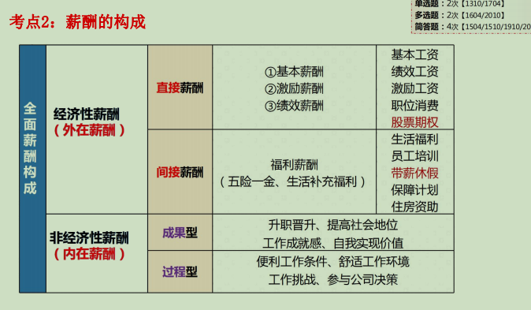
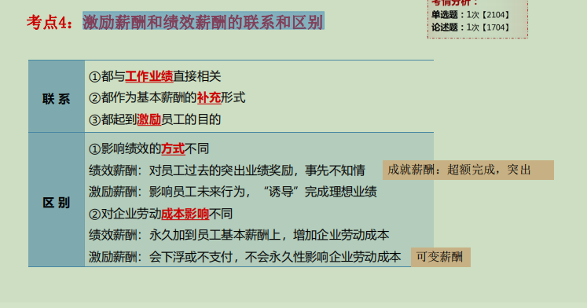
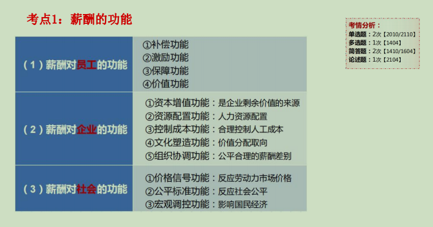
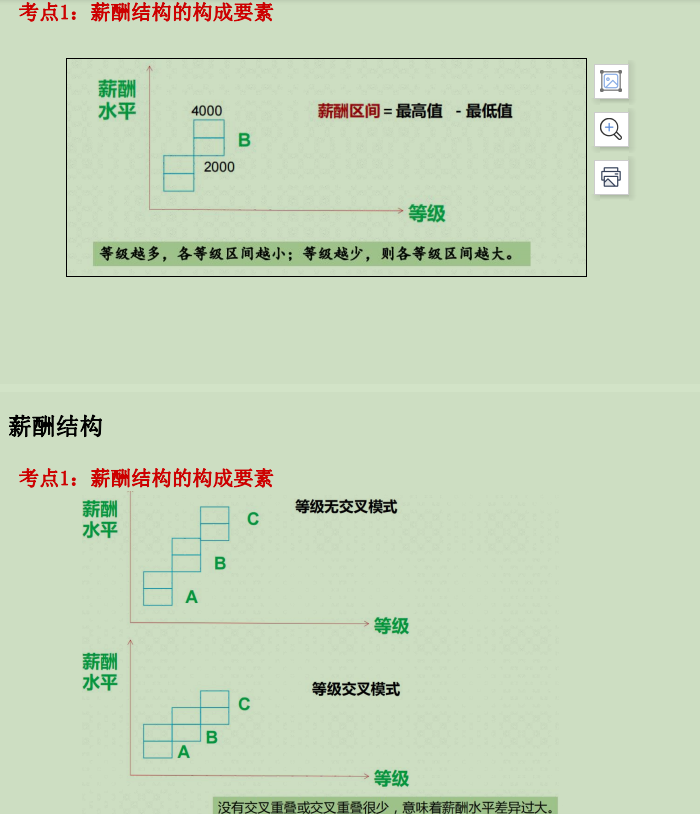
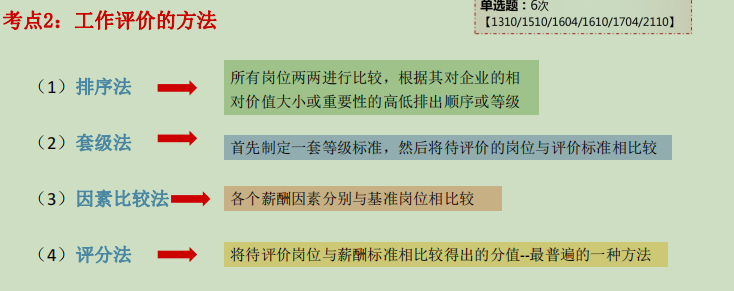

# 第九章  薪酬管理

# .......................................................................

# 第一节---薪酬概述

## 一.薪酬的概念

~~~
各种货币收入和各种福利酬劳之总和。

（1）基础是雇佣关系 （2）主体是雇主 （3）客体是雇员 （4）本质是一种等价交换过程（时间换金钱）
~~~

## 二、薪酬的分类和构成

### 1.分类:

~~~
（1）是否可以用货币衡量：货币性薪酬和非货币性薪酬 
（2）基本发生机制不同：外在薪酬和内在薪酬 
（3）支付量如何界定：计时薪酬和计件薪酬
（4）激励时间的长短：短期薪酬和长期薪酬 
（5）发放的标准：能力薪酬、绩效薪酬和职位薪酬
~~~

### 2.构成:

#### 1)基本薪酬和激励薪酬的特点区别:

~~~
（1）基本薪酬：（职位、技能或能力）常规性、稳定性、基准性、综合性 
（2）激励薪酬：（可变薪酬）补充性、激励性、灵活性、战略性
~~~

#### 2)激励薪酬和绩效薪酬的联系和区别:

#### 3)福利薪酬特点:

- 1）支付形式灵活，有针对性满足员工的生活需求； 
- 2）对企业起到节税效果； 
- 3）保证员工基本生活的有力补偿

## 三、薪酬的功能

# ..........................................................................

# 第二节---薪酬水平和结构

## 一、薪酬水平

### 1.概念:

~~~
指一定国家、区域、行业或企业内部各岗位、各部门或整个企业 劳动者平均薪酬的高低程度。
薪酬水平决定了企业薪酬的内部和外部竞争性。

层次：宏观薪酬水平、微观薪酬水平、个人薪酬水平
~~~

### 2.影响因素

1. 1）宏观因素： 

   ①劳动生产率水平 

   ②积累消费水平 

   ③政府政策法规的调节 

   ④劳动力市场供求状况 

   ⑤物价变动 

2. ）微观因素：

   ①企业经营效益 

   ②企业薪酬政策 

   ③企业规模和发展阶段 

   ④员工的异质性 

   ⑤劳资双方的谈判 

   ⑥心理因素

### 3.衡量指标

1. 1）薪酬平均率 = 实际平均薪酬 / 薪酬区间中间值 
2. 2）增薪幅度 = 本年度平均薪酬水平 －上年度平均薪酬水平
3. 3）平均增薪率 = 本年增薪幅度 / 上年平均薪酬水平

## 二、薪酬结构

### 1.构成要素

1. 1）薪酬的等级数量 

   等级越多，越明确，但也容易僵化 

   等级越少，越灵活，但也容易失控 

2. 2）薪酬趋势线 

   （最高、中位、最低趋势线） 

3. 3）同一薪酬等级内部的薪酬变动范围 

   。薪酬区间 （=最高值-最低值）

   。薪酬变动比率 

   。薪酬区间比较比率 

   。薪酬区间渗透度 

4. 4）相邻两个薪酬等级之间的交叉与重叠关系 

​     没有交叉重叠或交叉重叠很少，意味着薪酬水平差异过大

### 2.类型：

~~~
（1）以员工岗位为基础的薪酬结构（关键环节：工作评价）
   ①岗位内容：该岗位所要求的技能以及该岗位的职责
   ②岗位价值：该岗位对组织目标的相对贡献 
（2）基于任职者的薪酬结构
   ①技能 ：与工作有关的技能、能力、知识 
   ②能力：适应不同情况的能力
~~~

# ..........................................................

# 第三节--薪酬设计

## 一、薪酬设计的原则

~~~
（1）公平性（基础原则） 
   ①内在公平表现出的是激励性 
   ②外在公平表现出的是竞争性
（2）竞争性 
（3）激励性 
（4）经济性 
（5）合法性 
（6）战略性
~~~

## 二、薪酬设计的基本流程

~~~
（1）确定薪酬原则和策略 （2）工作分析 （3）工作评价★ （4）薪酬调查★ （5）工资结构设计 （6）工资分级及定薪 （7）薪酬体系的实施和修正
~~~

### 2.工作评价的方法

1. 排序法
2. 套级法
3. 因素比较法
4. 评分法

### 3.薪酬调查的步骤

~~~
是指通过正当途径、获取企业外部组织或个人相关薪酬信息的过程。
~~~

1. 1）确定薪酬战略 
2. 2）确定薪酬调查的范围和对象 
3. 3）进行薪酬调查 
4. 4）形成薪酬调查报告 
5. 5）应用薪酬调查结果

