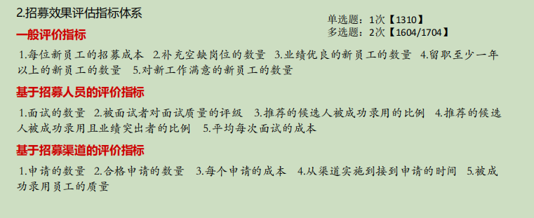

# 第五章 招聘管理

# .............................................................................

# 一.招聘概述

## 1.招聘概念和原则

### 1)概念:

~~~
组织为了发展需要,从组织内部或外部获取人力资源的过程,是人力资源规划的具体实施
~~~

### 2)原则:

- 公开原则--招聘信息公开透明
- 平等--应聘者一视同仁
- 能级--量才录用,用其所长
- 全面
- 择优--挑选最优人才
- 效率--低成本招聘高质量员工
- 守法

## 2.招聘前提和流程

### 1)前提:

- 人力资源规划--招人数,什么人
- 工作说明书--具体做什么

### 2)流程:

- 招募(首要环节)
- 选拔
- 录用
- 评估

## 3.招聘者职责

# .........................................................

# 二.人员招募

## <u>**1.人员招募的过程**</u>

1. 制定招募计划
2. 实施招募计划
3. 招募效果评估

## 2.制定招募计划

## 3.实施招募计划

- 1、招募人员的选择 

  

- 2、招募地点的选择 

  

- 3、招募开始时间的确定 

  

- 4、招募渠道的选择 

  

  

- 5、招募信息的发布 

  

- 6、招募的宣传策略

## 4.招募效果评估

### 1）评估内容

- 招募成本评估
- 招募人员评估
- 撰写招募效果评估小结

### 2）招募效果评估指标体系

1. 一般评价指标
2. 基于招募人员的评价指标
3. 基于招募渠道的评价指标

# .........................................................................

# 三.人员选拔

## 1.人员选拔的概念,过程,模式

### 1)概念:

~~~
从应征的候选人中选出组织需要的优秀人才，招聘工作 中最关键的一步，也是技术性最强的一步。
~~~

### 2)过程:

### 3)模式:

1. 综合式--接受所有测评
2. 淘汰式
3. 混合式

## 2.人员选拔的方法

### 1）方法：

1. 笔试--知识广度深,适合团体测试,效率高

   缺点>命题技术

2. 心理测试--内在心理特征标准化测量

3. 面试--通过沟通观察,面谈

   

4. 情景模拟(评价中心)---适合高级管理人才选拔

### 2）面试优缺点

### 3）面试类型

- 1）面试要达到的效果 （初步、诊断面试） 
- 2）参与面试的人员 （个别、小组、集体面试、流水式面试） 
- 3）面试组织形式 （结构化、非结构化、半结构化面试） 
- 4）测评目的 （压力、评估性面试） 
- 5）面试内容的侧重点 （行为描述、能力面试）

### 4）面试效果的影响因素

- 1）过早地做出录用的决策 
- 2）过早强调面试表中的不利内容 
- 3）面试者本人对空缺岗位的任用条件不了解 
- 4）面试者本人缺乏面试经验 
- 5）面试过程中，面试者讲的太多 
- 6）面试速度过快，时间较短 
- 7）面试者受前一位应聘者的影响，去衡量后一位应聘者 
- 8）容易出现晕轮效应、趋中效应、以貌取人、个人偏见等心理偏差

### 5）提高面试效果的对策

- 1）做好面试前准备工作 
- 2）围绕面试目的提问 
- 3）对每个应试者一视同仁 
- 4）营造和谐气氛

- 5）保持良好互动 
- 6）防止先入为主 
- 7）注意非语言行为 
- 8）防止“与我相似”的心理因素 
- 9）避免暗示 
- 10）采用小组面试

# ............................................................................

# 四.人员录用

## 1.人员录用原则

## 2.人员录用注意事项

- 1）正式录用后，要及时通知已录用应聘者，同时，对于未录用的应聘者，要由人力资 
- 源部门领导亲笔签名委婉地拒绝。 
- 2）录用后合同签订、试用期的培训等工作必不可少。 
- 3）如果空缺的岗位没有很大的发展前景，就不要录用能力超强的人。 
- 4）有些应聘者只想暂时先找一份工作安身，要特别小心。 
- 5）对那些频频更换工作的求职者，要特别小心。 
- 6）在决定录取某个人员时，要考虑这个人是否能跟小组里的其他成员相处。 
- 7）对那些自称运气不好的人也要特别小心。 
- 8）永远不要企图能在“百坏中选一好”。 
- 9）假如面试后合适的应聘者有好几个，要利用考试的方法，找出最佳人选。 
- 10）不要急着做决定