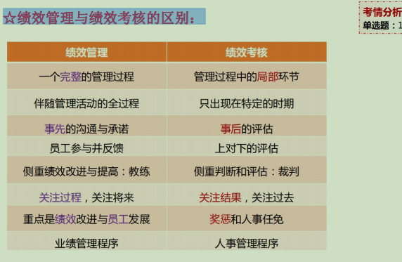
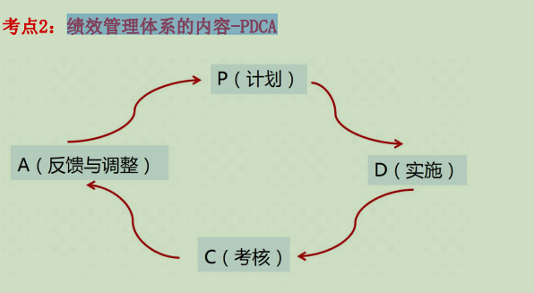
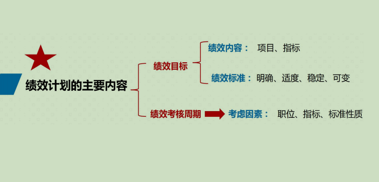

# 第八章  绩效管理

# ....................................................................

# 一.绩效管理概述

## 1.绩效的含义与特点

### 1)含义:

~~~
人力资源管理角度：人们从事某一种活动所产生的成绩和成果。
①“结果论”：绩效等于“结果”“产出”或“目标实现度”。 
②“过程论”：绩效等于“行为”。
③“潜能论”：绩效＝“做了什么”+“能做什么”。
~~~

### 2)要点:

1. 1）绩效基于工作而产生。 
2. 2）绩效与组织目标有关，对组织目标有直接的影响作用。 
3. 3）绩效是表现出来的工作行为和工作结果。 
4. 4）体现个人绩效、团队绩效。

### 3)特点:

- 多因性
- 多维性
- 动态性

## 2.绩效管理

### 1)含义:

~~~
制定员工绩效目标，对员工的目标完成情况做出评价和反馈，保证组织 目标完成的管理手段与过程
~~~

### 2)☆绩效管理与绩效考核的区别：

### 3)作用:

- 引导性
- 价值型
- 战略性

## 3.绩效管理体系的含义与内容

### 1)含义:

~~~
企业为了完成绩效管理，所构建起来的管理体系，就是绩效管理体系（PDCA）。
~~~

### 2)内容--PDCA

- 1）绩效计划（P）：起点，在公司、部门、个人层面设定绩效目标和衡量指标。 
- 2）绩效实施（D）：实施绩效计划的过程。 
- 3）绩效考核（C）：考核主体，考核方法，考核评价。 
- 4）绩效反馈与调整（A）：影响着组织实现绩效管理目的的程度。

(闭环控制系统PDCA)

# ................................................

# 二.绩效计划

## 1.绩效计划的含义和作用

### 1)作用:

~~~
（1）制订行动计划，指导PDCA有效实施。 
（2）增强后续工作的计划性，降低浪费和冗余。 
（3）对员工工作的监控和指导，为考核提供衡量指标，容易获得员工的接受。 
（4）员工参与计划的制订，增强员工参与感，提高员工对绩效目标的承诺。 
（5）将战略目标和员工考核指标相结合，有助于组织战略目标的实现
~~~

~~~
起参与计划+ 参与度高+ 能指导+ 有计划性+ 不浪费时间+ 监督= 战略目标实现
~~~

### 2)含义要点

~~~
绩效计划包含三部分内容：
①绩效目标体系和绩效考核周期-----①目标、时间
②为实现目标，员工应采取的措施----②员工怎么做
③对绩效跟进实施、考核和反馈阶段做规划和指导----③公司怎么做
~~~

### 3)主要内容:

## 2.绩效计划主要内容

### 1)绩效目标的制定

组成:绩效内容和绩效标准

#### (1)绩效内容：工作任务，应当做什么事情。

~~~
①绩效项目：工作业绩、工作能力和工作态度。
②绩效指标：对绩效项目的进一步细化和分解。 
a.工作业绩：数量、质量、成本和时间 
b.工作能力和工作态度：具体情况具体分析
~~~

#### (2)绩效标准：应该怎样来做或者做到什么程度

~~~
确定绩效标准时，应当注意以下几个问题：
①绩效标准应该明确：目标越明确，激励效果越好。
 A.量化标准类型：数值型的标准、百分比型的标准、时间型标准。
 B.能力和态度可用描述性标准。
②绩效标准的压力要适度：大多数人经过努力可以达到。
③绩效标准要具有一定的稳定性：保证标准的权威性。 
④绩效标准应该具有一定的可变性：技术的进步、工具的改进、生产效率的提高。
~~~

### 2)绩效考核周期

~~~
又叫绩效考核期限，一个完整的PDCA绩效管理循环的时间，指多长 时间应对员工进行一次绩效考核。
~~~

## 3.绩效计划的主要工具

### 1)目标分解

~~~
目标分解，指目标由组织的最高管理者设定，然后分解成子目标落实到组织的各 个层次上。体现自上而下向员工下达任务，体现出对员工的控制作用

特点:
（1）单向过程，从上往下，逐级设定。 
（2）对上一级目标的理解很重要。
~~~

### 2)关键绩效指标--KPI

#### (1)含义:

~~~
关键绩效指标，是把企业的战略目标分解为可操作的工作目标的工具。
~~~

~~~
含义的理解： 
①对公司战略目标的分解。
②对绩效构成中可控部分的衡量。
③对重点经营活动的衡量，而不是对所有操作过程的反映。
④组织上、下认同的
~~~

#### (2)设计流程

~~~
流程性、计划性和系统性。
~~~

- ①明确企业的战略目标：头脑风暴法和鱼骨分析法 
- ②各部门的主管建立部门级关键绩效指标 
- ③再将关键绩效指标进一步细分，分解为更细的关键绩效指标 
- ④设定评价标准 
- ⑤对关键绩效指标进行审核 

~~~
目标→ KPI（部门）→ KPI细分→ KPI评价→ 审核
~~~

### 3)平衡计分卡

#### (1)内容

- ①财务类指标：展现给股东、投资者看。 
- ②顾客市场类指标：客户形象。 
- ③内部运营类指标：经营效率。 
- ④学习与发展类指标：员工感觉。

#### (2)实现5个平衡

- ①财务与非财务的平衡 
- ②短期与长期的平衡 
- ③前置与滞后的平衡 
- ④内部与外部的平衡 
- ⑤定量指标和定性指标的平衡 

#### (3)实施步骤

- ①明确公司的使命、愿景和战略； 
- ②战略目标沟通，上下沟通； 
- ③基于战略的业务规划； 
- ④建立反馈机制、绩效考核和能力发展模型； 
- ⑤建立浮动薪酬的绩效激励系统。

#### (4)成功实施的决定因素

- ①最高管理层的决心、支持和推动； 
- ②人力资源管理部门需要提升到战略高度； 
- ③设定与企业战略相衔接的合适的目标； 
- ④整合组织机构和流程，强化跨部门团队合作，减少行政性干扰。

## 4.绩效沟通

### 1)含义和作用

~~~
（1）含义：绩效沟通是绩效管理的核心。绩效沟通贯穿整个绩效管理过程。 
（2）作用： 
   ①设定共同认可的绩效目标； 
   ②履行目标职责过程中不断沟通：清除障碍，提供支持和帮助；
   ③使考核思想深入人心，考核结果令人信服
~~~

### 2)内容与形式

~~~
（1）绩效沟通的内容：
   ①目标确定沟通
   ②实施过程沟通
   ③绩效反馈沟通 
   ④绩效改进沟通
 (2)绩效沟通的方式:
 ①正式沟通：事先计划和安排好的沟通（定期）。
   a.定期的书面报告 
   b.一对一正式面谈 
   c.定期的会议沟通 
 ②非正式沟通：未经计划的沟通。如非正式的会议、闲聊、走动式交谈、 吃饭时进行的交谈等。好处是形式多样、灵活，不需要刻意准备；沟通 及时，使问题很快得到解决；容易拉近主管与员工之间的距离。
 
~~~

# ...................................................................................

# 三.绩效考核

## 1.绩效考核的含义和作用

### 1)含义:

~~~
也叫绩效评价，指企业运用特定的指标和标准，对员工的工作行为 及工作业绩进行评估，并用评估的结果对员工将来的工作行为和工作业绩产生正 面引导的过程和方法
~~~

### 2)作用:

- 1）达成目标方面 
- 2）分配利益方面 
- 3）人员激励方面 
- 4）挖掘问题方面 
- 5）促进成长方面

## 2.绩效考核的流程

~~~
（1）确立目标：战略目标，选择考核对象。
（2）建立评价系统：评价主体，构建指标体系，选择考核方法。
（3）整理数据 
（4）分析判断：对评价对象进行最终的判断。 
（5）输出结果
~~~

## 3.绩效考核体系

### 1)绩效考核的主体

- 上级
- 同级
- 下级
- 个人

### 2)绩效考核的内容

- 1）关键业绩：任务的数量、质量及效率方面。 
- 2）能力素质：所担任的工作、职务，能力是大是小、是强是弱等。 
- 3）满意度：难以量化，从工作态度、基本能力、业务熟练程度、责任感、协调性等方面综合考核

### 3)绩效考核的方式

~~~
（1）比较法：相对考核的方法，通过员工之间的相互比较，从而得出考核结果。
   ①个体排序法（排队法） 
   ②配对比较法：两两比较，降低排队的难度。
   ③人物比较法：选出典型员工，以他的各方面表现为标准，对其他员工进行考核。 
（2）强制分布法（强制比例法、强制分配法）： 先确定几个绩效等级，如优、良、中、差、劣，人为地确定每个等级中的员工数在总 人数中所占的比例
（3）量表评价法：根据等级评价量表对被评价者进行评价（最广泛）。 
（4）目标考核法：按指标来衡量员工完成既定目标和执行工作标准的情况。
（5）关键事件法：由上级主管记录员工平时工作中的关键事件，做得特别好的和做得不好的。 
（6）行为锚定等级评价法：将同一职务工作可能发生的各种典型行为进行评分度量建立一个 锚定评分表，对员工工作中的实际行为进行测评记分。 实质上是关键事件法与量表评价法的结合。 
（7）360度绩效考核（“360度绩效反馈”或“全方位评估”）： 由员工自己、上司、直接部属、同事甚至顾客等全方位来了解个人的绩效
~~~

### 3)周期

~~~
多久进行一次绩效考核
~~~

1. 1）固定时间间隔：日考核、周考核、月度考核、季度考核、年度考核。 
2. 2）非固定时间间隔：一个任务或项目完成后进行的考核

## 4.绩效考核中常见的误区

1. 1）首因效应（首次效应、优先效应或第一印象效应）：考核者由于对被考核者第一印象不佳或很好，以至于在以后的绩效考核中对他的评价偏低或偏高。“以貌取人” 
2. 2）近因效应：被考核者可能一向表现平庸，但在临近考核期做了一件让主管非常满意的事情,导致主管在评分时依据这一事件掩盖其长期的碌碌无为，使评分偏高；被考核者最近的一次失误也可能使几个月的优秀表现付诸东流，最后的评分比相应的要低。 
3. 3）从众效应：当个体受到群体的影响（引导或施加的压力），会怀疑并改变自己的观点、判断和行为，朝着与群体大多数人一致的方向变化。 
4. 4）晕轮效应：最大弊端是以偏概全。
5. 5）趋中效应：将被考评者划为接近平均或中等水平。 
6. 6）拟己效应（像我效应）：即“以己度人”，主管将自己与员工相比较，与自己相似的员工在绩效考核中不由自主地打出高分；与自己共同点少的员工，则给分较低。
7.  7）个性效应：不同的主管一般有不同的个性，由于主管个性的不同，在绩效考核中可能对被考核者的要求也会不一样。 
8. 8）情感效应（情绪效应）：一个人的情绪状态可以影响到对某一个人今后的评价

# .....................................................................

# 四.绩效反馈

## 1.绩效反馈的含义和目的

~~~
绩效反馈是一种正式的绩效沟通。 

绩效反馈的目的： 
（1）回顾现有工作绩效情况，双方就绩效考核结果达成共识； 
（2）分析现存绩效问题，找出需要改进的方面； 
（3）展望未来绩效发展路径，共同协商下一个绩效周期的绩效目标。
~~~

## 2.绩效反馈面谈

~~~
绩效反馈面谈的技巧:
（1）保持友好认真的态度； （2）先肯定成绩，再指出缺点； （3）评估以事实为依据； （4）着重员工的工作绩效，避免涉及与此无关的问题； （5）把握面谈的局面，避免冷场，避免出现双方的冲突和僵局
~~~

## 3.绩效改进的含义

~~~
指确认工作绩效的不足和差距，查明产生的原因，制订并实施有针对性的 改进计划和策略，不断提高竞争优势的过程。 
绩效改进是绩效考核的后续应用阶段。
~~~

### 1)改进的过程:

~~~
（1）分析员工的绩效考核结果，明确其中存在的不足和问题； 
（2）一起对绩效问题进行分析，找出原因； 
（3）制订绩效改进目标和改进计划，并与员工达成一致； 
（4）以绩效改进计划补充绩效计划，帮助员工实现绩效计划
~~~

## 4.绩效考核结果的应用

1. 1）用于招募与甄选 
2. 2）用于人员调配 
3. 3）用于人员培训与开发决策 
4. 4）用于确定和调整员工薪酬