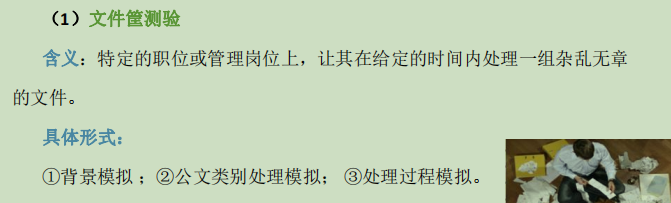

# 第六章 人员素质测评

# .....................................................................................

# 一.人员素质测评概述

## 1.人员素质测评的含义

### 1)素质含义

~~~
个体为完成某项活动与任务所具备的基本条件和基本特点， 是行为的基础与根本因素。
它包括身体素质、心理素质、道德素质和专业素质等方面。
~~~

### 2)素质模型

~~~
也称胜任素质模型，或胜任力模型，是个体所应具备的对个人绩效和企业成功产生关键影响的各种素质要素的组合。
~~~

### 3)素质的冰山模型--麦克利兰

### 4)素质的洋葱模型--博亚特兹

### 5)人员素质测评的含义

~~~
测评者采用科学的测量方法和手段对被测评者的身体 素质和心理素质进行测量和评价的过程.
测>量化式测验,评>定性化方式评价.
~~~

## 2.人员素质测评的作用、原理、原则

### 1)作用:

- ①是科学的人力资源开发的基础； 
- ②为招聘选拔提供科学的评价技术与工具； 
- ③为人岗匹配提供基本依据； 
- ④为绩效考核和诊断提供解决方法

### 2)原理和原则:

## 3.人员素质测评的类型、发展

### 1)类型:

- 1）配置性测评 — —人力资源的合理配置，人岗匹配 
- 2）选拔性测评 — —选拔优秀人才，如内部竞聘 
- 3）开发性测评 — —开发员工的素质 
- 4）考核性测评 — —又称鉴定性测评，鉴定与验证某种素质是否具备 
- 5）诊断性测评 — —了解素质现状或问题

### 2)类型的特点

### 3)发展:

# .....................................................................................

# 二.人员素质测评方法

## 1.心理测验

### 1)特点:

- ①对行为的测量； 
- ②对一组行为样本的测量； 
- ③不一定是真实行为，而是概括了的模拟行为； 
- ④标准化的测验； 
- ⑤力求客观的测量。

### 2)分类:

1. 认知测验--认知行为

   - 成就测验
   - 智力测验
   - 能力倾向测验

2. 人格测验--社会行为

   ~~~
   人格测验，是对人的行为中起稳定调节作用的心理特质和行为倾向进行定量分析， 以便进一步预测未来。可分为：兴趣、态度、性格、品德.

   人格，是个体所具有的与他人相区别的、稳定和独特的思维方式和行为风格
   ~~~

   - 量表法
   - 透射法
   - 作业法

   

## 2.面试

### 1)特点:

- 1）对象的单一性 ； 
- 2）内容的灵活性； 
- 3）信息的复合性 ； 
- 4）交流的直接互动性； 
- 5）判断的直觉性。

### 2)面试内容:

~~~
（1）仪表风度 
（2）知识点广度与深度 
（3）实践经验与专业特长 
（4）工作态度与求职动机 
（5）事业进取心 
（6）反应能力与应变能力 
（7）分析判断与综合概括能力 
（8）兴趣爱好与活力 
（9）自我控制能力与情绪稳定性 
（10）口头表达和沟通能力
~~~

### 3)方法技巧:

## 3.评价中心--*<u>高管和技术人员</u>*

### 1)特点:

- 1）情境模拟性（最大、首要特点） 
- 2）综合性 
- 3）全面性 
- 4）整体互动性 
- 5）预测性

### 2)优缺点:

~~~
评价中心通常用来选拔较高层次的管理人员和技术人员。 
（1）优点：较高的信度和效度，结论质量较高。
（2）缺点：投入大量人力、物力和财力，耗时长，操作难度大， 对测试者要求很高
~~~

### 3)形式:

1. 文件筐测验

   

2. 无领导小组讨论

   

   

3. 管理游戏

   

4. 模拟面谈

   

# .............................................................................

# 三.人员素质测评实施

## 1.实施程序

1. 准备阶段
2. 实施阶段
3. 评估结果阶段
4. 检验和反馈阶段

### ★1)准备阶段

1. <u>**1）构建测评指标体系：**</u> 
   - ①构建胜任素质模型； 
   - ②基于胜任素质模型筛选测评指标； 
   - ③确定测评指标权重； 
   - ④确定测评标度。 

1. 2）确定测评的工具和方法： 

考虑工具和方法的效度、公平程度、实用性、成本四个指标。 

1. 3）培训测评人员：使用统一的指示语。