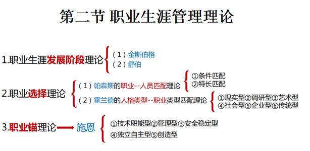
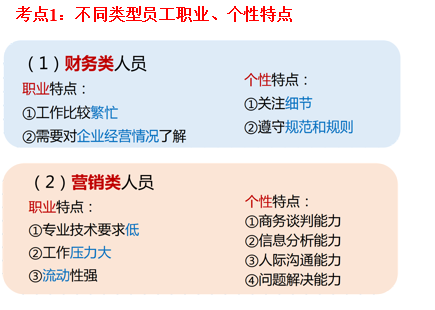
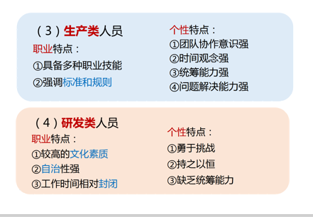

# 第十章  职业生涯管理

# ........................................................................

# 第一节 职业生涯管理概述

## 一、职业生涯

### 1.属性:

社会和经济属性

### 2.特征:

- 终身性
- 独特性
- 发展性
- 综合性

### 3.含义:

   职业生涯：员工个人职业的发展<u>**变化历程**</u>。

- （1）是个体概念，是指个体的行为经历，而非群体或组织的行为经历。
- （2）是职业的概念，实质是指一个人一生中的职业经历或历程。
- （3）是时间概念，意指职业生涯期。
- （4）是发展和动态概念，指个人的具体职业内容和职业的发展变化历程。

### 4.职业生涯管理的含义

~~~
（1）职业生涯管理指组织和员工本人对职业生涯进行设计、规划、执行、评估、反馈的一个综合管理过程。
（2）包含了两层含义：
   ①组织职业生涯管理。 
   ②个人职业生涯管理。

~~~

## 二、职业生涯管理的作用

- （1）使员工掌握职业发展的方法、获得公平持续的发展
- （2）人尽其才，使员工获得适宜的发展
- （3）实现员工发展与组织发展的统一
- （4）是组织吸引和留住人才的重要措施

## 三、职业生涯管理中的责任

### 1.责任主体

- 员工

  ~~~
  员工责任:
  （1）主动，获取有关自身的优势不足信息
  （2）明确自身开发需求
  （3）了解存在的学习机会
  （4）与内外员工接触
  ~~~

- <u>***经理(直线经理)***</u>

  ~~~
  直线经理扮演的角色:
  （1）教练：发现问题、倾听需求、界定需求
  （2）评估者：给出反馈、明确标准、确定工作职责和需求
  （3）顾问：提供选择、协助设置目标、提出建议
  （4）推荐人：与职业生涯管理资源联系、追踪规划执行情况
  ~~~

- 人力资源部门

  ~~~
  部门责任:
   提供信息建议、服务和咨询，提供资源。
   ①举办职业生涯研讨会
   ②提供关于职业和工作机会的信息
   ③制定职业生涯规划工作手册
   ④提供职业生涯咨询
   ⑤提供职业生涯发展路径
   ⑥职业生涯规划系统监督

  ~~~

- 组织

# ...................................................................

# 第二节 职业生涯管理理论

### <u>***(结构图)***</u>

## 一、职业生涯发展阶段理论

### 1.金斯伯格

童年>青少年阶段

~~~
（1）幻想期（11岁之前）：单纯凭自己的兴趣爱好。
（2）尝试期（11--17岁）：客观审视自条件和能力、开始注意职业角色的社会地位、社会意义。
（3）现实期（17岁之后）：客观性、现实性、讲求实际。
~~~

### 2.舒伯

整个人生

~~~
（1）成长期（0-14岁）：通过学校学习来认识自我，理解工作的意义。
（2）探索期（15--24岁）：深化职业和工作的认识，将学习成果沉淀，具体化自己的职业。
（3）建立期（25--44岁）：稳定工作，学会在家庭和事业之间合理地安排均衡。
（4）维持期（45--65岁）：巩固已有的地位并力争提升。
（5）衰退期（65岁以后）：安排退休和开始退休生活，精神上寻求新的满足点。
~~~

## 二、职业选择理论

### 1.帕森斯的职业--人员匹配理论

1. 条件匹配--专业技术
2. 特长匹配--人格特征

### 2.霍兰德--人职匹配理论

~~~
（1）现实型：木工、车工、电工 等 
（2）调研型：计算机程序设计、实验员、科研人员等
（3）艺术型：作曲家、画家、演员、服装设计师等
（4）社会型：导游、咨询人员、社会工作者、心理治疗医生等
（5）企业型： 厂长、经理、推销员、律师、政治家等 
（6）传统型：财会人员、速记员打字员、办公室职员、计算机操作者等
~~~

## 三、职业锚理论

### 1.施恩的职业锚理论

~~~
（1）技术职能型职业锚：重视个人专业技能的发展，喜欢面对富有挑战性的工作
（2）管理型职业锚：较强的权利和升迁欲望
（3）安全稳定型职业锚：选择有保障、稳定的工作
（4）独立自主型职业锚：追求自由环境，最大限度的摆脱限制和约束
（5）创造性职业锚： 意志坚定、勇于冒险，强烈的创造欲望
~~~

#### 1)职业锚的功能

~~~
（1）识别功能
 （清晰反映个人的职业追求与理想）
（2）促进员工与组织相互接纳的功能
 （组织可以获得员工个人明确的职业发展信息）
（3）提升员工价值的功能
 （职业锚确定后会在一定时间内稳定工作并发展）

~~~

# ..................................................

# 第三节 员工职业生涯规划

## 一、员工职业生涯规划

### 1.概念

~~~
员工职业生涯规划，是指员工根据自己的职业倾向，确定最佳的职业奋斗目标，对职业发展道路进行的设想和规划。

~~~

### 2.意义:

~~~
（1）个人角度：认识自我，发掘潜能，促进职业成功。
（2）组织角度：增强员工归属感，促进良性竞争，满足组织发展需求。
~~~

## 二、员工职业生涯规划的步骤与内容

~~~
（1）自我剖析与定位
（2）职业生涯机会评估
（3）职业生涯目标与路线的设定
    ①立足本职的生涯路线
    ②转换职业的生涯路线
    ③自我创业的生涯路线
（4）职业生涯策略的制定与实施
（5）职业生涯规划的反馈与修正
~~~

## 三、员工职业生涯规划的影响因素

~~~
（1）教育背景
（2）家庭影响
（3）个性与职业理想（人格特征、动机与需求价值）
（4）外部环境（社会环境、组织环境、机会运气）
~~~

## 四、不同类型员工职业生涯规划

# .................................................................

# 第四节 组织的职业生涯设计

## 一、职业生涯发展途径

### 1.途径:

~~~
（1）纵向职业途径— —向上晋升
（2）横向职业途径— —不晋升的基础上丰富工作内容
（3）网状职业途径— —横向、纵向综合发展
（4）多阶梯职业途径— — 平行的职业轨迹：管理、技术
~~~

## 二、职业生涯周期管理

### 1.职业生涯早期的员工

~~~
（1）特征： 
①进取心强，具有积极向上、争强好胜的心态
②职业竞争力不断增强，具有做出一番轰轰烈烈事业的心理准备
③开始组建家庭，逐步学习调适家庭和工作的关系
~~~

~~~
（2）早期员工的组织化： 
①个人组织化：自由人向组织人转化，向所有雇员灌输组织及其部门所期望的主要态度、规范、价值观和行为模式。
②加速组织化方法：
a.向新员工展示组织发展前景和工作发展前景 
b.员工的培训
c.给新员工配备职业顾问 
d.增加新员工在组织中的生存能力和发展机会
~~~

### 2.职业生涯中期的员工

~~~
（1）特征：（危机）
①身体开始衰老
②开始寻找新的生活目标
③家庭关系发生明显的变化
④工作颓废感日益强烈
⑤工作流动性下降
⑥对自己职业目标有多少实现了，多少没有实现，有清楚的认识
⑦工作关系发生变化，对新员工的指导功能加强
~~~

~~~
（2）应对措施：（自己）
①保持积极进取的精神和乐观的心态
②选择新的职业或进行职业角色选择决策转换
③成为良师益友，担任起言传身教的责任
④维护职业工作、家庭生活和自我发展三者间的平衡
（3）预防中期危机：（组织）
①帮助雇员自我实现：提拔晋升、安排富有挑战性工作、实施工作轮换、
赋予员工良师角色、改善工作环境
②建立内部晋升计划
③落实内部晋升计划，促进员工发展
~~~

### 3.职业生涯后期的员工

~~~
（1）特征：
①进取心、竞争力和职业能力明显下降
②权力和中心地位下降，角色发生明显变化
③优势尚存，仍可发挥余热，尽职贡献
（2）退休计划管理：
①树立正确观念，坦然面对退休
②开展退休咨询，着手退休行动
③做好退休员工的职业衔接
④采取多种措施，做好员工退休后的工作安排
⑤召开退休员工座谈会等多种形式关心退休员工

~~~

## 三、职业生涯延伸管理

~~~
（1）关注员工健康
（2）处理员工工作与生活的矛盾
（3）帮助再就业
（4）员工退休管理（心理、退休生活）
~~~

