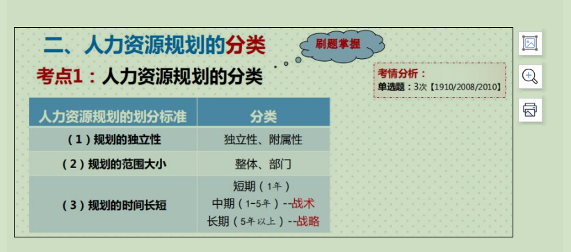
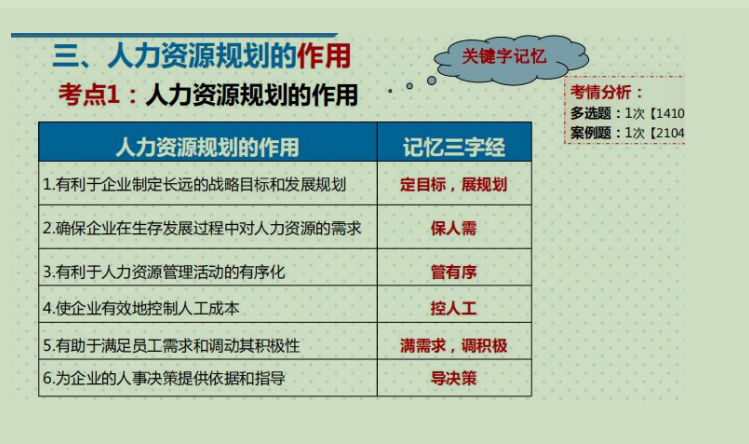
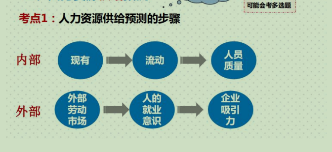
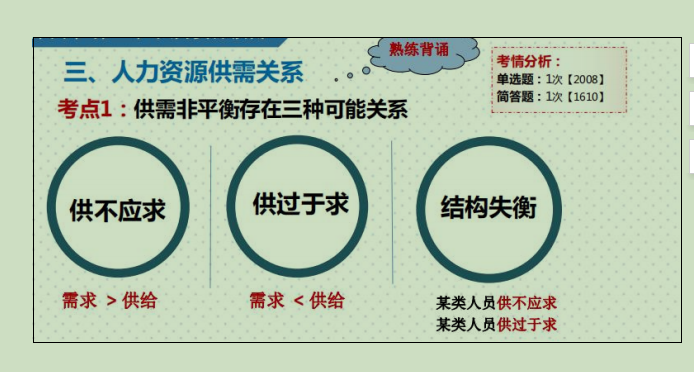
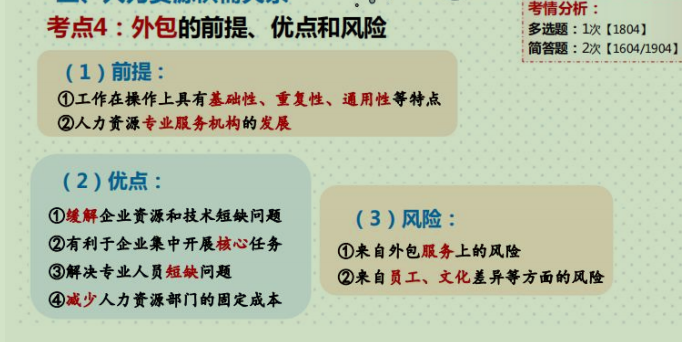
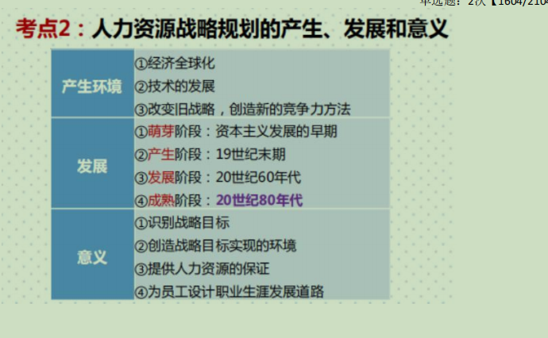
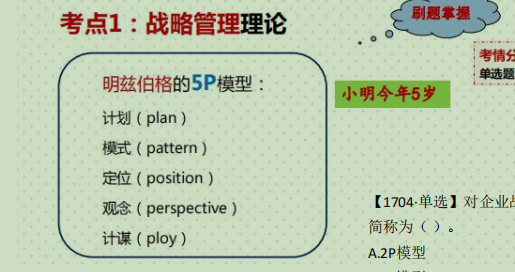
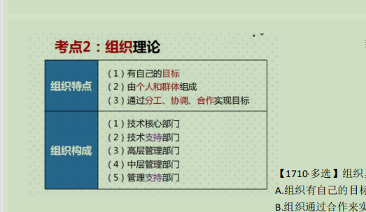
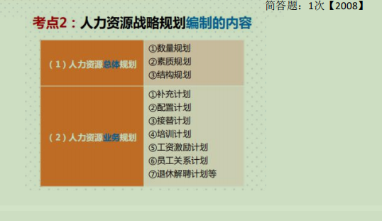

# 第四章 人力资源规划

# ......................................................................

# 第一节 人力资源规划概述

# 一.人力资源规划的含义:

1. 组织环境是变化的
2. 关键是确保人力需求如期实现
3. 使组织和个体得到长期利益
4. **<u>*目的是为了实现企业的战略目标,配备足够的人力资源*</u>**
5. 基础是搞清企业现有的人力资源状况
6. 主要环节是制定必要的人力资源政策和措施

# 二.人力资源规划的分类

# 三.人力资源规划的作用

# 四.人力资源规划的内容及程序及原则与目标

## 1.内容:

- 总体规划                                                    
- 配备计划
- 退休解聘计划
- 补充计划
- 使用计划
- 培训开发计划
- 职业计划
- 绩效计划
- 薪酬福利计划
- 劳动关系计划
- 人力资源预算

## 2.程序：

1. 准备阶段——全面掌握相关信息
   - 外部环境信息：政治，经济，文化等
   - 内部环境：组织，管理环境
   - 现有人力资源：数量，质量等
2. 预测阶段——预测人力资源供需
3. 实施阶段——实现人力资源的供需平衡
4. 评估阶段——实施效果评估

## 3.原则：

1. 目标性——效益，生产率，利润
2. 系统性
3. 适应性
4. 协调性——平衡
5. 科学预测
6. 动态性——变革
7. 开放性
8. 共同发展

## 4.目标：

- 配合组织发展需要
- 规划人力发展
- 促使人力资源合理利用
- 用人成本合理化

# ......................................................................................

# 第二节 人力资源预测

# 一.人力资源需求预测

## 1.预测方法

1. 定性方法(人员经验)
   - 管理评价法——管理者与人力专员一起预判
   - 德尔菲法(专家判断法)
     1. 预测筹划
     2. 专家预测
     3. 统计反馈
     4. 预测结果
2. 定量方法(具体数据)
   - 趋势分析法——根据过去预测未来
   - 比例分析法——配比进行预测
   - 回归分析法——数学回归原理
   - 计算机模拟法

# 二.人力资源供给预测

## 1.供给预测步骤

## 2.内部供给预测的方法

1. 技能清单法——记录反映工人工作能力和竞争力图表
2. 替换单法——岗位空缺预测人力需求
3. 人力资源"水池模型"——预测内部人员流动基础上预测企业的内部供给
4. 马尔科夫模型——预测一定时间段人员分布

# 三.人力资源供需关系

## 1.供过于求调整方法

1. 裁员
2. 提前退休
3. 变相裁员
4. 工作轮换
5. 工作分享(扩大就业)

## 2.供不应求的调整方法

1. 外部招聘

2. 内部招聘

3. 延长工时

4. 工作扩大化——身兼多职

5. 外包

   

# ..........................................................

# 第三节 人力资源战略规划

# 一.人力资源战略规划概述

## 1.概念:

~~~
是人力资源管理活动的基础。以企业战略目标为基础，对人力资源战略的目标，方针与政策，实施步骤及费用预算等做出的总体安排。
~~~

## 2.人力资源战略规划的产生，发展和意义

## 3.人力资源战略与人力资源规划的关系

- 人力资源战略是人力资源规划好的前提
- 规划是战略的延伸

~~~
人力资源战略具有目标性，方向和引导性，不具有可操作性。
人力资源规划具有可操作性。
~~~

# 二.人力资源战略规划的理论基础

1. 战略管理理论

   

2. 组织理论

   

# 三.人力资源战略规划体系

## 1.战略规划编制的目的

~~~
是配合企业组织的整体经营战略,以确保组织人力资源得以有效运用的过程
~~~

## 2.战略规划编制的内容

## 3.战略规划编制的层次

- 长期战略性人力资源战略的规划
- 短期经营性
- 人力资源战略规划的实施,控制与评价

## 4.战略规划编制的程序

1. 环境评估(内外在)
2. 设定目标与战略(近期,中期和远期目标)
3. 拟定方案(工作分析,招聘规划,绩效考核规划等)
4. 实施与控制