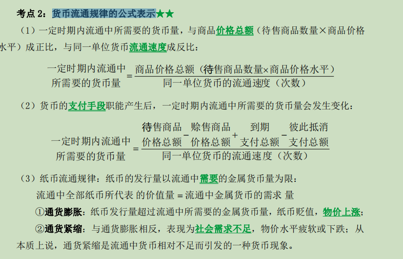
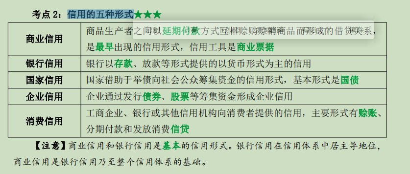

# -----第三章 货币与信用

# 第一节 货币的形成和本质

## <u>一、货币的产生</u>

### 1.产生过程

- （1）货币是商品交换发展的产物，是在商品交换过程中从上商品世界分离出来的固定地充当一般等价物的商品；
- （2）货币的产生过程就是价值形式的发展过程；
- （3）价值形式发展经历的四个阶段
  1. 简单的或偶然的价值形式
  2. 总和的或扩大的价值形式
  3. **一般价值形式(质变阶段)**
  4. 货币形式

### 2.金银作为货币的特点

- （1）质地均匀、便于分割；
- （2）体积小、价值大，便于携带；
- （3）不易变质，便于永久保存。

## <u>二、货币的本质</u>

~~~
是固定地充当一般等价物的特殊商品，体现商品生产者之间的社会经济关系。
~~~

# .........................................................................

# <u>第二节 货币的职能和货币流通规律</u>

## <u>一、货币的职能</u>★

|     职能     |             定义             |                           货币形式                           |
| :----------: | :--------------------------: | :----------------------------------------------------------: |
| **价值尺度** | 以定量货币衡量和表现商品价值 |                       观念或想象的货币                       |
| **流通手段** |      充当商品交换的媒介      |                   现实货币,不是观念上货币                    |
|   贮藏手段   |  把货币作为社会财富贮藏起来  | 必须是足值的金属货币或者金银制品，不能是观念上货币,也不能是价值符号 |
|   支付手段   |        以货币偿还贷款        |                                                              |
|   世界货币   |         世界市场作用         |                 必须是金银等贵金属,不是纸币                  |

## <u>二、货币形式的发展</u>

~~~
从货币具体形式来看，一般经历了非金属实物货币、金属货币、纸币、信用货币、电子货币的发展过程。虽然货币的形式发生了很大的变化，但是货币的本质和基本功能没有改变
~~~

## <u>三、货币流通规律</u>

### 1.内容

1. （1）货币流通规律是指在一定时期内流通中所需要的货币量的规律；

2. （2）一定时期内流通中所需要的货币量的取决于三个因素★

   ①流通中待售商品的数量；

   ②商品价格水平；

   ③货币流通速度。

3. （3）<u>一定时期内流通中所需要的货币量，与商品价格总额（待售商品数量×商品价格水平）成正比，与同一单位货币流通速度成反比。</u>

### 2.公式表示★

# .......................................................

# 第三节 信用

## <u>一、信用的产生及形式</u>

### 1.产生的基础

商品经济的产生和发展是信用产生的基础。

### 2.信用的5种新式★

#### 1.商业信用

##### 1)特点

- ①商品生产者之间以商品形态提供的信用，贷出的资本就是待实现的商品资本；
- ②主要是职能资本在商品买卖中相互提供的信用，其债权人和债务人都是职能资本；
- ③商业信用的发展程度直接依存于商品生产和流通的状况。

2)经济繁荣时期，生产发展，商业信用随之扩大；而在经济危机时期，生产下降，商业信用也随之陷入萎缩状态；

3)商业信用的工具是商业汇票，它是债权人和债务人之间的债务凭证。商业票据分为期票和汇票两种：

- ①**<u>期票</u>**是债务人向债权人开出的定期付款的保证书；
- ②**<u>汇票</u>**是债权人向债务人发出的在一定时期内向持票者支付款项的命令书，要求债务人向第三者或持票人支付一定款项的凭证。

##### 4)局限性

- ①规模受单个职能资本家拥有的资本数量的限制；
- ②规模还受到资本周转快慢的限制；
- ③范围受到商品流转方向的限制。

#### 2.银行信用

- 特点:
- （1）银行信用的债权人是货币资本所有者，债务人是职能资本，银行信用的实质是银行作为中介使货币资本所有者通过银行和职能资本之间发生信用关系；
- （2）银行信用的对象是货币资本，对企业来说，属于间接融资；
- （3）银行信用可以突破商业信用的局限性，扩大了信用的规模和范围

## <u>二、信用在市场经济运行中的作用</u>

### 1.积极作用

促进市场经济发展

- ①增加投资机会、促进资本的自由转移，推动社会资源的优化配置；
- ②加速资本的积聚和集中；
- ③加快商品流转的速度、节省流通费用；
- ④给居民提供新的投资渠道和金融融资的持有方式，可以使每个家庭把它们的消费按时间序列进行适当的安排，形成合理的消费结构；
- ⑤有效地调节着国民经济运行

### 2.消极作用

加深市场经济的内在矛盾

- ①加深了生产和消费的矛盾，触发生产过剩的危机；
- ②引发货币信用危机；
- ③信用刺激投机。

