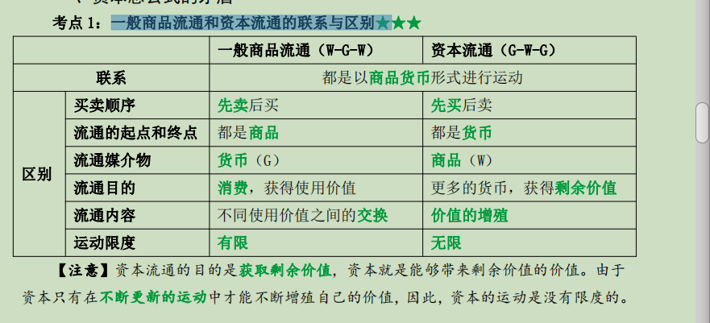
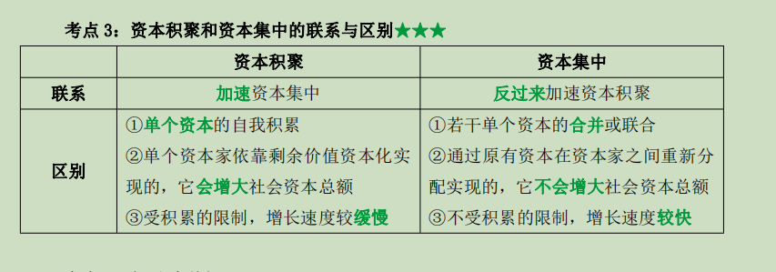

# ------第四章 剩余价值的生产

# 第一节 货币转化为资本

## <u>一、资本总公式的矛盾</u>

### 1.一般商品流通和资本流通的联系与区别★

### 2.资本总公式的矛盾

~~~
（1）资本的流通公式 G-W-G’表明了资本运动的最根本特点，即货币在运动中发生了价值增殖，因而对产业资本、商业资本、借贷资本等资本运动的各种具体形式都是适用的，表现为资本的总公式；
（2）资本总公式的矛盾：从形式上看，资本总公式中的价值增殖和价值规律是矛盾的。因为按照价值规律的要求，在流通过程中，无论是 G-W 还是 W-G，商品的价值量都不发生变化。而资本总公式呈现出来的现象是，经过流通，资本的价值发生了增殖。这就是资本总公式的矛盾；
（3）要解决资本总公式的矛盾，就要说明剩余价值是怎样产生的：
   ①剩余价值不能从流通领域中产生。在商品流通中，无论是等价交换，还是不等价交换，都不会产生剩余价值；
   ②离开流通领域，剩余价值也不能产生。在流通领域之外，商品所有者只同他自己的商品发生关系，这种关系表明，商品生     产者只能由自己的劳动形成的商品的价值，而不能在形成价值时又形成剩余价值。
（4）剩余价值发生的阶段：剩余价值只能发生在第一阶段 G-W 所购买的商品上，而且是这种商品的使用价值上。这种商品的使用价值在创造自身价值的同时，能够创造出比自身价值更大的价值。这种特殊的商品就是劳动力，劳动力转化为商品是货币转化为资本的前提
~~~

## <u>二、劳动力成为商品</u>

### 1.条件

- （1）劳动力所有者必须有人身自由，可以自由支配自己的劳动力；
- （2）劳动力所有者丧失了一切生产资料和生活资料，除了自己的劳动力以外一无所有，只能靠出卖劳动力为生。

### 2.劳动力商品的价值决定

1. （1）劳动力商品的价值由生产和再生产劳动力商品的社会必要劳动时间决定；

2. （2）具体包括：

   ①劳动者本人所必需的生活资料的价值，用于维持劳动力的再生产；

   ②劳动者养育子女所必需的生活资料的价值，用于延续劳动力的供给；

   ③劳动者接受教育和训练的费用，用于培训适合资本主义再生产所需要的劳动力。

3. （3）此外，劳动力商品的价值决定还包括历史和道德的因素

# ..................................................................

#  第二节 剩余价值的生产过程

## <u>一、资本主义劳动过程</u>

### 1.对其理解

1. （1）资本主义的生产过程首先表现为生产各种物质资料的劳动过程；

2. （2）资本主义劳动过程是资本家消费他所购买的劳动力的过程，具有以下特点：

   ①工人在资本家的监督下劳动；

   ②工人的劳动产品全部归资本家所有。

3. （3）资本家的目的：根本目的不是生产使用价值，根本目的是生产一个比他预付的资本价值更大的价值，即生产剩余价值

## <u>二、资本主义的价值形成过程和价值增殖过程</u>

### 1.价值增值的基础

价值增值是在价值形成的基础上实现的

### 2.价值增值过程

1. （1）价值增值过程不外是超过一定点而延长了的价值形成过程，这个一定点就是工人补偿劳动力价值所需要的劳动时间；

2. （2）在这里，工人的劳动时间分成两部分：

   ①必要劳动时间：再生产劳动力价值的时间；

   ②剩余劳动时间：无偿为资本家生产剩余价值的时间。

3. （3）资本带来剩余价值的原因是资本家利用它剥削了雇佣工人的剩余劳动。

## <u>三、不变资本和可变资本</u>

1. （1）区分不变资本和可变资本的依据：生产资本在剩余价值生产过程中所起的作用不同；

2. （2）不变资本和可变资本:

   ①不变资本（C）：以生产资料(机器、厂房等)形式存在的资本，在生产过程中不改变自己的价值量；

   ②可变资本（V）：以劳动力形式存在的资本，在生产过程中发生了价值增殖

3. （3）区分不变资本和可变资本的意义：

   ①进一步揭露了剩余价值的来源和实质，说明了剩余价值只是由可变资本产生的，即雇佣工人的剩余价值劳动是剩余价值产生的唯一源泉；

   ②为考察资本家对雇佣工人的剥削程度提供了科学依据

## <u>四、剩余价值率</u>

### 1.商品价值的构成

~~~
不变资本 c、可变资本 v 和剩余价值 m，即商品价值为 c＋v＋m；
~~~

### 2.剩余价值率

~~~
表示价值增殖程度和资本家对雇佣工人的剥削程度
~~~

### 3.剩余价值率(m')的表示方法★

- ①物化劳动表示法：m'＝剩余价值/可变资本＝m/v；
- ②活劳动表示法：m'＝剩余劳动时间/必要劳动时间。

4.资本家要获得更多的剩余价值，一般通过提高对工人的剥削程度和增加可变资本总量这两条途径

# .......................................................

# 第三节 剩余价值生产的基本方法

~~~
资本家剥削工人的具体方法是多种多样的，但概括起来有两种基本方法：绝对剩余价值和相对剩余价值生产。
~~~

##  <u>一、绝对剩余价值生产</u>★

1. （1）雇佣工人在必要劳动时间不变的条件下，由于工作日的绝对延长而生产的剩余价值称做绝对剩余价值。此外，资本家还用提高工人劳动强度的方法来榨取更多的剩余价值；

2. （2）工作日的界限：

   ①工作日的最低界限：必须在必要劳动时间以上；

   ②工作日的最高界限取决于：

      a.生理因素

      b.社会道德因素

3. （3）工作日长度的确定最终取决于资产阶级和无产阶级之间的力量对比。

## <u>二、相对剩余价值的生产</u>★

- （1）相对剩余价值---在工作日长度不变的条件下，由于缩短必要劳动时间，相应延长剩余劳动时间而生产的剩余价值；
- （2）个别企业提高劳动生产率，获得超额剩余价值，对超额剩余价值的内在追求和竞争的外在压力，不断促使各个资本家采用新技术，提高劳动生产率；
- （3）当整个社会劳动生产率提高后，劳动力价值下降，必要劳动时间缩短，剩余劳动时间延长，所有资本家由此获得相对剩余价值。

## <u>三、绝对剩余价值生产与相对剩余价值生产的关系</u>

### 1.联系

- ①从资本对雇佣劳动的关系来看，两者在本质上是一致的；
- ②绝对剩余价值生产是资本主义剥削的一般基础，也是相对剩余价值生产的起点。

### 2.区别

- ①物质技术基础不同：绝对剩余价值生产是与生产技术不变，或生产技术发展缓慢相适应的；而相对剩余价值生产是以生产技术的不断变革为条件的；

- ②它们在资本主义发展的各个历史阶段上所起的作用不同：

  a.简单协作阶段--绝对剩余价值生产；

  b.工场手工业和机器大工业阶段--相对剩余价值生产。

## <u>四、资本主义工资</u>

### 1.本质

1. （1）劳动力是存在于人身体中的劳动能力；劳动则是劳动力的使用，它的实现必须以生产资料和劳动力的结合为条件；

2. （2）资本主义工资的本质：劳动力的价值或价格；

3. （3）资本主义工资的基本形式：

   ①计时工资：按一定的劳动时间来支付的工资，其实质是劳动力的日价值、周价值、月价值的转化形式；

   ②计件工资：按工人完成的产品数量或完成的工作量来支付的工资，是计时工资的转化形式

4. （4）资本主义工资的分类：

   ①名义工资：货币工资，是指工人出卖劳动力所得到的货币数量；

   ②实际工资：工人用货币工资实际买到的各类生活资料和服务的数量，不仅取决于名义工资的高低，还取决于物价的高低。

5. （5）资本主义工资的变动：

   ①就资本主义工资的变动趋势看，名义工资一般呈增加趋势；

   ②从资本主义发展的历史过程看，实际工资则有时降低有时提高。

# .................................................

# 第四节 再生产与资本积累

## <u>一、资本主义再生产</u>

### 1.社会再生产的分类

（1）按内容来讲：是物质资料再生产和生产关系再生产的统一；

（2）按规模来讲：简单再生产和扩大再生产。

### 2.简单再生产

#### 1)含义

~~~
资本家把剩余价值全部用于个人消费，生产只是在原有规模上重复进行的资本主义再生产
~~~

#### 2)特点

- ①资本家付给工人的工资，即用来购买工人劳动力的可变资本，是工人自己创造的；
- ②不仅可变资本是工人创造的，而且全部资本都是工人创造的；
- ③工人的个人消费是为资本家再生产劳动力的必要条件。

### 3.扩大再生产

#### 1)含义

~~~
资本家把一部分剩余价值转化为新资本，用来购买追加的生产资料和劳动力，使生产在扩大的规模上重复进行；
~~~

#### 2)作用

可以进一步揭露资本主义生产方式的本质。

- ①资本家这一次用来购买劳动力的资本，只不过是上一次从工人身上榨取到的剩余价值的一部分；
- ②由剩余价值转化而来的资本，在购买劳动力并变成工人的消费基金以后，不但要由工人在生产中补偿，而且在补偿时还要加上新的剩余价值

## <u>二、资本积累</u>

### 1.含义

~~~
资本积累是指把剩余价值作为资本使用，或者说剩余价值的资本化。
~~~

### 2.实质

~~~
在扩大再生产过程中，资本家不断地利用无偿占有的剩余价值扩大生产规模，扩大对工人的剥削，来继续榨取更多的剩余价值
~~~

### 3.具有客观必然性

- （1）资本主义生产的目的决定了资本家追求剩余价值的欲望是无止境的，对剩余价值的无限贪婪，成了推动资本家不断进行资本积累的内在动力；
- （2）资本主义的竞争规律作为一种强制力量，也迫使资本家不断地实行资本积累，资本主义竞争是资本家不断进行资本积累的外在压力。

### 4.影响资本积累规模的因素

- （1）对劳动力的剥削程度，即剩余价值率的高低；
- （2）社会劳动生产率的水平；
- （3）所使用的资本和所消耗的资本之间差额的大小：所使用的资本是指在生产过程中全部发挥作用的资本，所消耗的资本是指逐年转移到新产品中去的那部分资本价值，差额越大，提供无偿服务的劳动资料越多，越有利于资本积累；
- （4）预付资本量的大小：剩余价值率一定的条件下，预付资本量越大，获取的剩余价值量也越大，资本积累的规模也会越大。

## <u>三、资本有机构成</u>

### 1.资本构成

1. （1）**资本技术构成**：从物质形态看，资本是由一定数量的生产资料和劳动力构成的，它们之间的比例是由生产技术水平决定的，这种反映生产技术水平的生产资料和劳动力之间的比例，称做资本的技术构成；
2. （2）**资本价值构成**：从价值形态看，资本是由一定数量的不变资本和可变资本构成的，不变资本与可变资本之间的比例就称做资本的价值构成；
3. （3）资本的价值构成以资本的技术构成为基础，资本的技术构成决定资本的价值构成；
4. （4）由资本技术构成决定且反映资本技术构成变化的资本价值构成，称为资本的有机构成，一般用 c:v 表示。

### 2.个别资本增大的基本形式

- （1）资本有机构成的提高，一般是以个别资本的增大为前提的。个别资本的增大有两种基本形式，即资本积聚和资本集中；
- （2）资本积聚：个别资本通过资本积累增大自己的资本总额，是资本积累的结果；
- （3）资本集中：把原来分散的中小资本合并成少数大资本。在资本主义发展的历史过程中，资本集中是借助于竞争和信用两个强有力的杠杆来实现的。

### 3.资本积累和资本集中的关系

### 4.相对过剩人口

1. （1）相对过剩人口的形成：随着资本积累的增加，资本有机构成的不断提高，一方面出现了资本对劳动力需求相对减少，甚至绝对减少的情况，另一方面也出现了劳动力的供给不断增加的情况，这两个相反方面发展的结果，就是大量的劳动者失业，相对过剩人口形成。这种“相对过剩”仅仅是因为劳动力的供给超过了资本主义积累对劳动力的需求，是资本主义积累的必然产物；

2. （2）相对过剩人口是资本主义生产方式存在和发展的必要条件：

   ①由于相对过剩人口的存在所形成的产业后备军，使资本主义生产的发展随时都能获得可榨取的劳动力；

   ②由于相对过剩人口的存在，资本家还可以加强对在业工人的剥削。

## 四、资本主义积累的一般规律

~~~
随着资本积累而产生的社会两极分化，即一极是财富的积累，另一极是贫困的积累。
~~~

