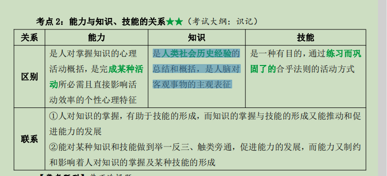

# ----------第四章 个性差异与管理

# 第一节 能力的差异与管理

## 一.能力概述

### 1.概念

~~~
 (1）智力是大脑的一种心理潜能，是以抽象思维能力为核心的，包括感知能力、观察力、记忆力、注意力等诸因素的有机结合；
（2）能力是智力在一定条件下被开发和发展的一种心理特征，是指人顺利地完成一定活动所具备的稳定的个性心理特征
    人的个性心理特征包括：能力、气质、性格。
~~~

###  2.能力与知识、技能的关系

### 3.结构★

~~~
（1）能力的二因素学说：英国心理学家斯皮尔曼提出了能力的二因素学说，该学说认为，能力是由一般因素 G 和特别因素 S 构成的；
（2）能力的群因素学说：美国心理学家塞斯登提出了能力的群因素理论；
（3）智力的三维结构学说：美国心理学家基尔福特提出了“智力的三维结构”理论,该学说认为，每一种智力因素都包括操作、内容和产品三个方面；
（4）智力层次结构学说：英国心理学家阜南提出了智力按层次排列的结构；(对能力二因素的深化)
（5）智力多元论：美国心理学家加德纳提出了智力多元论；
（6）三元智力论：美国心理学家斯登伯格提出了三元智能结构理论，将智力结构分为成分智力、经验性智力、实用性或情境性智力等
~~~

### 4.种类★

- （1）按能力的倾向划分：一般能力、特殊能力（智力属一般能力的综合）；
- （2）按能力的创造性程度：再造性能力、创造性能力；
- （3）按心智功能差异：液态智力、晶态智力；（由卡特尔提出）
- （4）从能力测验的观点来看：实际能力、潜在能力；
- （5）桑代克对能力划分：社会的智慧、具体的智慧和抽象的智慧

## 二.能力差异的分析

3.特殊能力的个别差异--不同层次的管理人员

（1）一般高层次管理者：决策能力；

（2）中层次管理者：人际协调能力；

（3）低层次管理者：业务技术能力

### 4.性别差异

~~~
（1）就男女两性整体而言，男女两性在智力上没有差异；
（2）男女两性即使在智力上有差异，但差异的方向不能肯定；
（3）男女两性在特殊能力及职业选择上有明显差别。
~~~

## 三、能力的差异与管理

### 1.能力差异在管理中意义

- （1）创造力的管理；
- （2）掌握招聘的能力标准，合理招聘选择人才；
- （3）根据人的能力差异，对员工实施有效的职业技术教育和能力的训练；
- （4）人尽其才，量才任用；
- （5）贯彻正确的用人原则与方法。

### 2.培养与开发管理层与员工的创造力的方法

~~~
（1）保持自尊、好奇与探索心理，激发创造力；
（2）营造宽松的环境与氛围，延缓评论；
（3）坚定理想信念与信心，培养创造性人格倾向；
（4）鼓励与培养首创、独创、创新精神和品质；
（5）开放潜意识（灵感），巧用酝酿技术与效应；
（6）使用头脑风暴，开发想象力与创造的方法，掌握创造的技法；
（7）左右脑的协同及理性与直觉结合，采用理性与发散、直觉与形象思维训练的方法；
（8）经常采用各种强迫关联技巧，使两个不同事物的属性进行强迫性联想；
（9）培养良好的学习、探索、创新的个性或人格品质
~~~

### 6.贯彻正确的用人原则与方法

####  1)原则

- ①因事择人，贯彻用人之长原则；

- ②不拘一格与破格使用原则；

- ③能当其位原则；

- ④协调原则；

- ⑤动态平衡与结构合理原则；

- ⑥宽松原则；

- ⑦经济与效能原则；

- ⑧竞争与优化原则；

- ⑨信任原则

#### 2)方法

- ①授权法（做到合理性、量力性、荣责性、可控性、信任性、宽容性）；

- ②长短法（做到扬长避短，取长补短、用短为长）；

- ③用当其佳法（不要贻误时机、要把握人生最佳的发展阶段）；

- ④杂交优补法（采取引进式、调整式、互学互补式的选拔与应用人才的方法）。

# ······················································

# 第二节 气质的差异与管理

## 一.气质概述

1. 定义;

   ~~~
   是受人的高级神经活动类型的制约与影响，典型地表现在人们心理过程的强度、速度、灵活性与倾向性等动力性方面的个性心理特征；
   ~~~

2. 内涵:

   ①人的气质受个体先天生物组织制约，是人出生时就具有的个性特征；

   ②气质的动力性特点主要表现在人的认识、情绪、意志、行为活动中的非动机性方面；

   ③气质是人的一种典型的、稳定的个性心理特征

## 二.气质的学说

### 1.体制和体型学说

~~~
（1）克瑞·奇米尔提出了按体型划分气质类型：瘦长型、肥胖型、筋骨型；
（2）谢尔顿、史蒂文斯提出按胚叶划分类型的学说：
    ①肥胖乐观是为内胚叶（脏腑）型；
    ②瘦小、敏感、反应快是为外胚叶（皮肤神经）型；
    ③体健、好动、竞争是为中胚叶（骨骼肌肉）型
~~~

### 2.激素和体液学说

~~~
（1）现代激素理论认为内分泌腺体活动与气质类型有关；
（2）希波克拉特的体液学说，认为体内含有 4 种体液，分别是血液、黏液、黄胆汁、黑胆汁。后经过发展演变为 4 种体液类型：多血质（血液占优势）、胆汁质（黄胆汁占优势）、黏液质（黏液占优势）、抑制质（黑胆汁占优势）
~~~

### 3.神经机制与高级神经活动学说

~~~
巴甫洛夫发现神经活动的三种特性，即兴奋和抑制的强弱特征、兴奋和抑制的均衡与不均衡特征、兴奋和抑制转换的灵活性特征。
~~~

## 三.在管理中作用

### 1.气质的意义

~~~
（1）扬长避短，发挥特长，合理匹配，提高工作效率；
（2）注意互补，协调关系；
（3）认识差异，关注健康；
（4）因人而异，管理教育
~~~

###  2.气质类型

1. 多血质

   ①行为特征：活泼好动，敏捷，喜交往，注意力转移，兴趣易变化，具有外倾性；

   ②适宜工作：社交工作、外交工作管理人员、律师、记者、演员、侦探等需要表达、活动与组织力的工作；

   ③心理特征：情绪快而多变、思维动作敏捷、表情丰富、直率、浮躁；

   ④积极与消极影响：活泼热情、善交际，反应灵活，工作效率高，但稳定性差；

   ⑤管理重点：着重培养踏实专一和克服困难的精神，克服分心与见异思迁的缺点；创造条件，多给活动机会；对其缺点可以严厉批评。

2. 黏液质

   ~~~
   ①行为特征：安静稳重，沉默寡言，情绪不易外露，注意力稳定，善于忍耐，具有内倾性；
   ②适宜工作：自然科学研究、教育、医生、财务会计等需要安静、独处、有条不紊以及思辨力极强的工作；
   ③心理特征：情绪发生慢而弱，思维、语言与动作迟缓，坚韧、冷漠、执拗；
   ④积极与消极影响：镇静踏实，但反应迟钝；
   ⑤管理重点：着重培养热情爽朗和朝气蓬勃的精神；对其批评教育要有耐心，允许其有足够的时间考虑与作出反应。
   ~~~

3. 胆汁质

   ~~~
   ①行为特征：直率，热情，精力旺盛，易冲动，心境变化剧烈，具有外倾性；
   ②适宜工作：社交、政治经济、军事、地质勘探、推销、节目主持人、演说家等工作；
   ③心理特征：精力充沛、情绪发生快强，言语、动作急速而难以控制、易怒、果敢；
   ④积极与消极影响：外向开朗、反应快、效率高，但暴躁任性，自我控制力差；
   ⑤管理重点：着重培养自制力和坚持到底的精神；注意方式方法，不要顶牛与激怒；可以进行有说服力的批评与教育
   ~~~

4. 抑郁质

   ~~~
   ①行为特征：孤僻，迟缓，情绪体验深刻，善于觉察事物的细节，具有内倾性；
   ②适宜工作：研究工作、机要秘书、检查员、打字员等无需过多与人交往，但必须有较强分析力与观察力以及耐心细致的工作；
   ③心理特征：柔弱、易倦、情绪发生慢而强，敏感而富于自我体验，动作弱小无力、内孤僻；
   ④积极与消极影响：耐受力差，易疲劳，但观察细微，感情细腻，办事谨慎；
   ⑤管理重点：着重培养友好、合作刚毅、开朗，自信的精神；对其多关心、爱护、鼓励、疏导；不宜公开批评。
   ~~~

# .................................................

# 第三节 性格的差异与管理

## 一.性格概述

1. 概念:

   指“特征、标志、属性或特性”。

   ~~~
   ②人的性格：指一个人对现实的态度和习惯化了的行为方式中表现出来的较稳定的有核心意义的个性心理特征
   ~~~

2. 特点:

   态度倾向性、社会制约性、稳定性及可塑性等特点

## 二.性格特征的分析

### 1.性格结构

（1）性格的态度特征：

- ①表现一个人对社会、集体和他人的态度的性格特征；
- ②表现一个人对劳动、生活、学习的性格特征；
- ③表现一个人对待劳动产品的性格特征；
- ④表现一个人对待自己的性格特征。

（2）性格的情绪特征、意志特征、理智特征：

- ①情绪特征表现在情绪的高涨与低落等，主导心境有乐观与悲观等特征方面；
- ②意志特征有自觉性与盲目性，独立性与易受暗示性等方面；
- ③理智特征主要表现在人的认知风格方面的特征，有分析性与综合性等

## 三.性格的类型★

~~~
（1）性格机能类型：培因和 T.李波将性格分为理智型、情绪型、意志型和中间型；
（2）性格内外倾向型：荣格将内向与外向为两大类型；思维、情感、感觉和直觉等为机能类型。他又将两者结合起来，组合成     八种性格机能类型；
（3）优越型与自卑型：阿德勒根据个人竞争性的不同进行划分，还有类似的 A、B 型人格和 T 型人格（T＋体力型，T＋智力     型，T－型）；
（4）场独立型与场依存型：威特金根据人对外界环境认知与依赖程度的不同进行划分；
（5）“五因素性格类型”：研究者采用因素分析方法得出 5 个基本的性格特质类型：开放性、责任心、外倾性、宜人性或随和     性、神经质或情绪稳定性；
（6）社会文化类型：
 ①斯普兰格从人类社会文化生活与价值取向的角度，分为 6 种类型：
  理论型、经济型、审美型、宗教型、权力型、社会型；
 ②霍兰德根据人的性格与职业选择的关系，分为 6 种类型：
  a.实际型：适合从事各类工程．．（机械、电工技术、司机）及农牧渔业等工作；
  b.研究型：适合从事数学物理、化学、生物、天文、地理、心理学、经济、人等各
    类学科的研究及计算机操作工作；
  c.艺术型：适合艺术、音乐，戏剧工作、语言学研究和写作；
  d.社会型：适合从事教育医疗服务、社会工作及社会科学工作；
  e.企业型：适合从事经理、管理、营销、政府官员、律师等工作；
  f.传统型：适合从事会计出纳、统计、审计、文秘、行政、外贸等工作。
~~~

## 四、性格差异与管理

### 1.与其他方面

~~~
（1）性格是人的个性特征的核心成分；
（2）性格与人际关系：人际关系是影响管理绩效的重要因素；
（3）性格与创造力、竞争力：职工的创造力和竞争力是属于能力的范畴，这是关系到一个企业能否生存、发展，是否有生命力的一个重要心理品质；
（4）性格与领导类型：
   ①专制型领导与教养方式会使人产生冷淡、攻击、依赖、服从、情绪不稳等性格特征；
   ②民主型会使人产生积极、友好、合作、独立、直爽、社交、情绪稳定等性格；
   ③放任型领导会产生无组织无纪律、无目标、放任自流的性格。
~~~

### 3.根据人的性格进行差别管理的措施

~~~
（1）主动型的人：对能力强的人以授权方式为主；对能力弱的人要帮助他们进步，逐渐提高他们的能力；
（2）被动型的人：对能力强的人明确其具体责任，赋予确定的激励机制；对他们中能力弱的人，一定要辅以较为完美的管理制度和激励方法；
（3）个性突出，缺点、弱点明显的能人：一是要使其扬长避短；二是要做好思想和情感沟通的交流；三是要放开一点，采取忍耐和期待的办法；
（4）对有特殊才能的人，一定要尽可能给他们最好的条件和待遇
~~~

