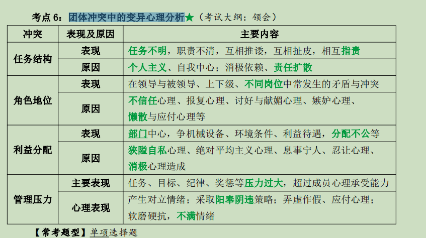

# --------第七章 团体行为与管理

# 第一节 团体与团队概述

## <u>一、什么是团体、工作团体与工作团队</u>

### 1.团体

#### 1)概念

~~~
团体是通过人们彼此之间相互交往、联系和影响，而形成的为达到共同的目标，满足共同的需要，以一定的社会活动方式和社会规范联系在一起的一种组织的集体形态。
~~~

#### 2)特征

- ①团体内部各成员之间相互依赖、相互联系，在心理上相互意识到对方；
- ②团体各成员之间，通过活动与交互作用，在心理上和行为上能彼此影响；
- ③团体各成员在情感上有“我们同属一个群体”的感受

#### 3)条件

~~~
（2）维系团体生存与发展的基本条件是：
①团体成员有共同的目标；
②为了实现团体目标，团体必须有共同遵守的规范和规则；
③团体要满足各个成员的归属感，每个成员都意识到其他成员的存在，也意识到成员之间有互动作用、相互依存、有感情联系；
④团体有一定的结构，每个成员有一定的地位，扮演一定的角色，执行一定的任务，有一定的权利与义务；
⑤团体成员之间有工作、信息、思想、情感上的沟通与交流等。
~~~

### 3.工作团体和工作团队

#### 1)概念

美国学者罗宾斯将团体区分为**<u>工作团体和工作团队</u>**；

- （1）工作团体：通过成员相互作用，来共享信息作出决策，帮助每个成员更好地承担自己的责任，其绩效仅仅是每个成员个人贡献的总和，比如田径队；

- （2）工作团队：通过成员共同努力能够产生积极的协调作用，其团体成员的共同努力使团队绩效水平大于个体成员成绩的总和，如同一支训练有素的足球队。

  <u>工作团队的类型有：问题解决团队、虚拟团队、自我管理团队、交叉功能团队。</u>

#### 2)区别★

|    区别    | 工作团体             | 工作团队               |
| :--------: | -------------------- | ---------------------- |
|  **目标**  | 信息共享强调个人目标 | 强调团体绩效与团体目标 |
| **协调性** | 较差                 | 高度协调               |
|  **责任**  | 强调个体化责任       | 有个体化与团队两种责任 |
|  **技能**  | 随机与不同           | 相互补充的技能         |

## <u>二、团体的种类</u>

### 1.种类

- ①正式团体：为了完成一定的任务，达成组织的特殊目标而设立的；
- ②非正式团体形成的主要原因：价值观念的一致性；利益的一致性；兴趣爱好、个性特点的一致性；相似的经历和背景

### 2.非正式团体的管理和引导

（1）要正确认识非正式团体；

（2）要合理利用非正式团体为实现组织的目标服务；

（3）对于不同类型的非正式团体，要区别对待:

- ①积极型的非正式团体，管理者应予以支持和保护；
- ②与正式团体目标不一致的消极型的非正式团体，应加强教育，积极引导；
- ③违法的、破坏性的非正式团体，应通过法律手段和程序予以取缔、打击。

## <u>三、团体的功能</u>

### 1.组织作用

~~~
（1）团体是组织结构的组成部分，其有利于团体与组织的决策，能完成特定的工作任务，来实现组织的总目标，这是团体对组织来说最重要的功能；
（2）团体是产生新思想、新观念、新办法的手段，有利于促进复杂的决策；
（3）团体在各部门之间起联络作用，有利于形成“一条龙”流水作业
~~~

### 2.个体作用

- （1）满足成员的安全需要；
- （2）满足成员的归属需要和社会交往需要；
- （3）满足成员的成就感和自我实现的需要，以及责任感和尊重的需要；
- （4）增强成员的信心和力量

### 3.社会作用★

~~~
（1）社会助长效应：指由于团体其他成员在场，消除了单调情境，激发了工作动机，从而提高了工作效率；
（2）社会标准化倾向：由于有行为的常模和团体规范的制约和影响，个体行为差异明显变小。这种团体成员的行为趋向同一标准的倾向，成为社会标准化倾向；
（3）社会顾虑倾向：也称社会干扰现象，指个体在大众面前，由于心理不自在，其行为表现拘谨，反应效果下降的现象；
（4）社会惰化现象：指与一个人单独工作相比，当人们作为团体的一个成员工作，其工作动机、努力水平、个人责任与工作绩效有可能下降的趋势；（如三个和尚没水喝）
（5）极化现象与责任扩散效应：极化现象指与个人单独决策相比，团体决策可能会出现更加冒险与更加保守的倾向。其原因有多种，最主要是责任扩散；
（6）从众行为倾向：是指个体在团队中，不知不觉地受到团体压力的影响，促使其行为与团体行为相一致的现象。
~~~

# .......................................................

# 第二节 团体的凝聚力、士气、规范、压力和高效率

## <u>一、团体的凝聚力</u>

### 1.概念

团体的凝聚力即指团体对每个成员的吸引力和向心力，以及团体成员之间相互依存、相互协调、相互团结的程度和力量；

### 2.高凝聚力团体特征

- ①有良好的团体气氛，其成员间意见沟通快，信息交流较为频繁，互相了解较为深刻，民主气氛好，关系和谐；
- ②有较强的吸引力、向心力，其成员愿意参加团体活动，出席率较高；
- ③团体成员有较强的集体主义精神与责任意识，愿意承担任务，维护团体利益和荣誉；
- ④团体成员有强烈的归属感、尊严感、自豪感等集体主义的情感。

### 3.影响因素

~~~
（1）领导因素；
（2）团体的同质性；
（3）外部的压力；
（4）团体的内部奖励方式；
（5）团体成员的荣誉感、成就感、归属感等团队精神和情感；
（6）团体的规模、规范与风气对凝聚力的影响；
（7）其他因素
~~~

### 4.与生产率的关系

生产效率并非由凝聚力这单一因素决定，如果团体目标与组织目标一致，则凝聚力与生产效率之间成正相关，反之，则凝聚力与生产效率呈负相关。

## <u>二、团体的士气</u>

### 1.概念

士气的本意是指军队作战时的集体战斗精神。其含义延伸到现代企业和组织的管理之中，表示团体的工作精神、服务精神和团体精神。

### 2.影响因素

- （1）对组织目标的认同与赞同；
- （2）公平合理的经济报酬；
- （3）团体成员的事业心及对工作的热爱和满足感；
- （4）优秀的领导者及领导集团；
- （5）团体成员之间人际关系和谐与心理相容性；
- （6）良好的信息与意见沟通；
- （7）奖励方式得当；
- （8）良好的工作与心理环境

### 3.与生产率的关系★

- <u>*（1）士气只是提高生产效率和工作效率的必要条件之一；*</u>
- <u>*（2）高士气的团体不一定有高的生产效率，但是其对高效率来说是必不可少的条件。*</u>

## <u>三、团体规范和团体压力</u>

### 1.概念

~~~
（1）团体规范是指团体所确定的、每个成员都必须遵守的行为标准与行为准则；
 (1)团体规范形成后，会产生一种迫使其成员行为与团体规范相一致的压力，这种压力叫团体规范压力。它不具有强制执行性质，而是在个体心理与行为上造成心理舆论压力
（2）从众行为是指个人心理与行为不知不觉的受团体中大多数人心理与行为的影响，而保持与多数人一致的倾向。
~~~

### 2.规范形成

- （1）正式程序明文规定的；
- （2）非正式程序形成的、约定俗成的；
- （3）心理机制有模仿、暗示、顺从等。

### 3.规范类型★

团体绩效规范、团体形象规范、社交约定规范、资源分配规范

### 4.团体规范的管理

- （1）一方面要充分发挥团体规范的积极作用，警惕规范一致性的消极作用；
- （2）要处理好正式与非正式团体规范的差距与关系；
- （3）防止旧规范的惰性作用；
- （4）要重视我国企业团体心理的变化特点；
- （5）要分清领导的意愿与团体规则与规范的界限；
- （6）管理者在运用团体规范压力，应注意避免团体规范压力对其个人创造性的压抑。

## <u>四、团体高效率的调查与管理</u>

### 1.高效率团体的特征

- （1）团体内部及团体与上下级之间有良好的沟通；
- （2）团体成员之间有高度的交互作用与影响力、凝聚力；
- （3）决策分权化和参与决策的过程，多数成员有较大的自由度；
- （4）团体成员乐意接受组织目标；
- （5）团体成员有较强的工作与成就动机；
- （6）团体成员有良好的情绪状态和精神状态；
- （7）有较高的生产量与生产效益；
- （8）成员有较强的工作满意感

### 2.影响因素

- （1）独立变量：包括结构变量、工作变量和环境变量；
- （2）中间（派生）变量：领导者的作风、团体士气的高低、团体凝聚力与友谊的关系、团体成员参与程度；
- （3）从属（结果）变量：团体的生产量、团体成员需要的满足

### 3.管理、建设、塑造高绩效团队

- （1）团队规模适度；
- （2）培养与开发成员的能力；
- （3）强化团队角色多样性结构；
- （4）团队共同目标的承诺；
- （5）建立明确具体的目标；
- （6）建设好团队领导班子与骨干力量；
- （7）防止责任扩散，社会惰化，增强个人与共同责任心；
- （8）建立绩效评估与奖酬体系；
- （9）培养诚信精神，注意培养正直、能力、可靠、忠实、开放等五个维度的品质。

# ..............................................................

# 第三节 团体的意见沟通

## <u>一、意见沟通概述</u>

### 1.概念

~~~
（1）意见沟通：指两个或两个以上人之间经由联络渠道，传递与交流信息、思想观点、情感愿望、意见，达到相互了解与理解的过程；
（2）信息沟通：指信息在个体或团体之间的交流和传递。
~~~

### 2.程序(构成要素)

- （1）信息发出者；
- （2）信息编码：意见化为信息；
- （3）信息传播通道；
- （4）信息接收者；
- （5）译码：接收者依据过去的经验对信息解释，将编码信息还原；
- （6）接收者的反馈。

### 3.作用

- （1）能为团体提供努力工作的方向、资料、情报、知识等外部环境信息；
- （2）能为团体提供内部的信息；
- （3）是领导者和被领导者、企业与“相关利益者”之间增进了解和理解的工具；
- （4）是调节人际关系，增强凝聚力与士气，加强文化建设的重要手段；
- （5）可以改变人的态度与行为，能促进企业改革与推行某项决策的有效执行。

### 4.沟通的功能和人际信息沟通的划分★

~~~
（1）费斯汀格将沟通按功能分为两种：工具式沟通和满足需要的沟通；
（2）人际信息沟通的划分：自我克制型；自我防守型；自我暴露型；自我谈判型；自我实现型。
~~~

## <u>二、意见沟通的方式（或种类）</u>

### 1.沟通种类

1. （1）从组织层次观点分为：个人与个人沟通；团体与个人沟通；团体与团体沟通；

2. （2）信息沟通是否反馈：单向沟通和双向沟通；

3. （3）组织结构和流动方向：上向、下向、平行沟通方式:

    ①上向沟通：是纵向沟通的一种方式，是团体成员通过组织系统直接向该团体领导者或高级领导人传递情报，反映意见；

    ②下向沟通：指团体领导者、管理者对职工进行的信息沟通；

    ③平行沟通：指在组织系统中，层次相当的个人及团体（不同部门）之间所进行的信

   息传递和交流。 

4. （4）沟通范围：内部、外部；正式、非正式；

5. （5）沟通工具：言语沟通（包括口头言语沟通和书面言语沟通）、非言语沟通。

## <u>三、意见沟通网络</u>

### 1.概念

~~~
由两个或两个以上沟通通道组成的结构形式称沟通网络
~~~

### 2.类型★

- （1）正式沟通网络类型：链式沟通、环式沟通、Y 式沟通、轮式沟通、全渠道式沟通。

  ​      **<u>①传播信息速度方面：轮式最快，链式和 Y 式较快，环式慢，全渠道式很慢；</u>**
        **<u>②工作变化的弹性方面：轮式和链式是慢，Y 式是较慢，环式和全渠道式是快</u>。**

- （2）非正式沟通类型：美国心理学家戴维斯发现非正式沟通途径有四种传播方式：单线式、流言式、偶然式、聚焦式。

## <u>四、意见沟通的障碍和意见沟通障碍的解除</u>

### 1.障碍

~~~
（1）语言表达、交流和理解造成的意见沟通障碍；
（2）态度、观点、信念和思想感情造成的意见沟通障碍；
（3）人的气质性格个性差异与隐性心理冲突引起意见沟通的障碍；
（4）隐性心理冲突引起的意见沟通障碍；
（5）其他：物质与距离障碍、超载与技能障碍、代码与程序障碍、组织结构与机制的
障碍等
~~~

### 2.解除

- （1）提高沟通的心理水平；
- （2）正确地运用语言文字；
- （3）学会有效的聆听方法；
- （4）学会有效沟通的方法与艺术。

# ....................................................

# 第四节 团体的人际关系

## 一.团体的人际关系的概述

### 1.概念

~~~
（1）概念：表示人与人之间相互交往、联系和影响而形成心理行为关系称为人际关系；
（2）心理结构与成分：认知、情感、行为意向。
~~~

### 2.人际关系的类型★

~~~
（1）根据交往关系范围分为：个人之间的关系、个人与团体的关系、个人与组织的关系；
（2）根据人际交往需要不同分为：包容的需要引起的人际关系、控制的需要引起的人际关系、情感型需要引起的人际关系；
（3）根据交往双方的相互关系状况，美国社会心理学家霍尼将团体人际关系分为：
①逊顺型，其特点是“朝向他人”，顺从行为，讨人喜欢；
②进取型，其特征为“对抗他人”，总想知晓他人力量对自己是否有用；
③疏离型，其特征为“疏远他人”，常思考别人是否干扰自己。
（4）我国学者提出类型：合作型、竞争型、分散型。
~~~

### 3.李雷的“刺激--反应”模型

~~~
人际关系行为的八种模式：尊敬和服从的反应；信任和接受的反应；协助和温和的反应；劝导和帮助的反应；骄傲、控制等反应；惩罚或拒绝的反应；敌对和反抗等反应；不信任和自卑的反应。
~~~

### 4.PAC模型★

~~~
（1）P 代表父母的行为，是权威和优越感及长者自居的心理标志，行为表现是常常统治人、训斥人、家长式的作风，待人处事的态度是主观独断、滥用专权；
（2）A 代表成人的心理与行为，是成熟、实事求是、理智的标志，行为表现较冷静、慎重，其待人接物的态度较民主、平等、决策冷静；
（3）C 代表了儿童的行为，是幼稚、冲动任性或顺从、任人摆布的标志，行为表现是幼稚、可爱又讨厌、感情冲动，其待人接物的态度易小孩子气
~~~

## <u>二、影响人际关系的因素和人际关系的测量</u>

### 1.影响因素

~~~
（1）空间距离与交往频率；
（2）相似性与同质；
（3）需要、性格、气质的互补作用；
（4）能力与专长；
（5）仪表
~~~

### 2.测量

社交测量法，美国心理学家莫雷诺最先创造。

## <u>三、改善人际关系障碍的方法</u>

### 1.改善原则

- （1）交互与强化原则；
- （2）社会交换（或功利性）原则；
- （3）人际吸引的增减原则（肯、否定的应用）；
- （4）情境控制与联结的原则。

### 2.改善策略

- （1）建立良好关系的策略（印象、主动、同情、帮助）；
- （2）建立良好沟通的策略；
- （3）维持友情的策略（协商与竞争、尊重与指责、错误与承认、设身处地等）；
- （4）缓解冲突的策略

### 3.改善方法

1. 成员个人

   ①摆正各种关系的位置，妥善处理好人际之间的矛盾；

   ②加强自我意识的修养，能勇于和改正自己的错误；

   ③采用角色换位与角色扮演方法，加强个人心理品质与个性特征的锻炼与训练；

   ④加强情绪与意志力的培养，以及良好个性和行为的训练；

   ⑤按照“PAC 分析”方法，改善人际交往

2. 管理者和领导者

   ①建立一个强有力的领导班子；

   ②建立良好的组织结构；

   ③组织员工参与管理；

   ④加强团体成员之间的信息交流和意见沟通；

   ⑤培养职工的集体主义精神和团队精神。

3. 其他关系

# .........................................................

# 第五节 团体的决策

## <u>一、团体决策及其过程</u>

### 1.含义

~~~
团体决策是指企业（组织与团体）的重大问题，在领导者的主持下，员工参与，通过集体讨论，作出最佳选择与决定的过程
~~~

### 2.过程

1. （1）提出问题，识别问题，明确决策的目标。

2. （2）问题的诊断阶段，也是发现、探索和拟定各种可能的行动方案过程。（包括分析问题，研究一般原则→提出解决问题的途径和方法→归纳决策方案）

3. （3）动作选择过程：

   ①有合理的选择依据和标准，具体包括：价值标准、程度标准、执行标准；

   ②有科学的选择方法，具体选择方法有经验判断、数学分析与实验方法。

4. （4）实施方案并进行追踪决策

### 3.决策的基本原则与方法★

1. 原则

   ①决策目标明确；

   ②信息情报准确、充分；

   ③多种决策方案中进行选优；

   ④可行性论证（有效性、可能性、重要性）；

   ⑤行动反馈

2. 方法

   ①缺少反应：只面向一个或几个成员建议的解决方法；

   ②独裁法则：领导宣布决定；

   ③少数法则：少数有专业知识的人，有更多发言权“强行通过”的决策；

   ④多数法则；投票表决法，多数赞成通过；

   ⑤一致法则：基本一致通过；

   ⑥完全一致：一票否决方法。

### 4.影响决策因素

主观,客观,文化因素

## <u>二、决策类型和组织层次</u>

### 1.类型

- （1）根据决策目标战略地位分为：战略性决策（重大方案）和战术性决策（局部问题）；
- （2）根据问题的性质分为：确定型、非确定型、竞争型决策；
- （3）应用计算机专门术语分为：程序性和非程序性决策（西蒙分类）；
- （4）根据决策的价值取向分为：稳妥性与冒险性决策。

### 2.组织层次(管理关心)

- （1）高层管理人员关注非程序性与战略性决策；
- （2）基层管理人员通常关注程序性与战术（业务）决策；
- （3）中层管理人员主要集中于程序性战术（管理）决策，也参与非程序性决策

## <u>三、决策的效用理论</u>

~~~
在非确定条件下决策，可以选择的决策准则：
（1）可能达到最高回收额的“极大化最高准则”，即“大中取大”的赫威斯决策准则；
（2）可能达到最低回收额的“极大化最低准则”，即“小中取大”的瓦尔德决策准则；
（3）可能引起决策者避免最大遗憾回收额的“极小化最高准则”，即萨凡奇决策准则；
（4）机会均等准则。
~~~

## <u>四、决策理论和团体决策中的利弊分析</u>

### 1.决策理论

~~~
（1）西蒙的行为决策理论：合理的决策原则是满意原则；
（2）智能框架理论：
   ①决策者是决策过程中最关键的因素之一；
   ②一个好的决策过程的四个部分：建立决策框架、信息的采集和智能的分析、通过判断和选择决策方案、通过反馈改进决   策；
   ③决策陷阱有框架盲点、框架错位、框架固化；
   ④黄金法则：“一个问题，一个框架”“学会多角度看问题”，“避免决策陷阱”的发生。
（3）丹尼尔·卡尼曼的不确定性决策理论，其理论有以下三个基本原理：
   ①大多数人在面临获得的时候是持风险规避的心理；
   ②大多数人在面临损失的时候是持风险偏爱的心理；
   ③一般来说，人们对损失往往比对获得更加敏感。
~~~

### 2.团体决策的优点/缺点

1. 优点:

- （1）集思广益，决策的信息完整全面；
- （2）集体讨论，采取头脑风暴法、激发想象力、创造性，决策的思路和观点多样；
- （3）能够增强成员的参与意识和积极认同的价值观念；
- （4）团体决策能够增强决策的科学性水平，大大提高决策的质量；
- （5）增加成员对决策的了解和信任，提高接受性水平

​    2.缺点:

- （1）团体决策的冒险迁移和保守倾向。
- （2）团体思维。

### 4.在团体决策中造成冒险和保守两种极端倾向的原因

- （1）责任扩散的影响；
- （2）团体领导者的影响；
- （3）团体中多数人的偏爱与从众心理的作用；
- （4）冒险和保守价值估计的影响。

### 5.团体决策科学化

~~~
（1）对团体决策给予指导，集思广益，充分利用可取信息，鼓励大家发表不同意见，提出质疑，以便做出正确决策；
（2）领导者应保持公正态度，在决策过程的前后应当鼓励、听取和重视不同意见；
（3）重大的决策，先小组讨论，将各组不同意见提交大组讨论，选取最佳决策方案；
（4）已作出的决策，实施前应先听取专家和群众意见，进行专门复审；
（5）为避免团体决策时的责任扩散，采取“问责制”与“决策失误赔偿制”。
~~~

# ......................................................

# 第六节 团体的竞争、合作与冲突

## <u>一、竞争、合作的含义与特点</u>

### 1.概念

~~~
（1）竞争：指团体中个人与他人之间或团体与团体之间为了达到一定的目标而相互争胜，力争压倒对方取得优势地位的心理状态和行为活动；
（2）合作：指两个或两个以上的个人或团体为了达到某种目标，齐心协力，相互配合，相互促进，共同导向目标的心理状态和行为活动
~~~

### 2.合作条件与心理行为特点

- （1）合作必须有共同的目标；
- （2）合作者之间都必须具备一定的物质基础；
- （3）合作者之间能以共同或互相补偿的形式促使他们的需要、利益和兴趣得到满足；
- （4）合作者之间必须具有一定的知识和技术

## <u>二、团体的合作、竞争与效率</u>

### 1.竞争对团体行为、个体心理及企业效益的影响

~~~
（1）竞争有助于改变传统的企业管理体制、机制与方法，推行目标管理的责任机制；
（2）竞争有助于职工树立新观念，增强主体与主人翁意识，充分调动职工的积极性、主动性、创造性增强竞争动力；
（3）增强内部的团结合作和凝聚力，缓和团体内部的冲突，协调团体内部的人际关系；
（4）竞争的压力会迫使组织、团体从战略眼光出发，发展科学技术，造成一种尊重知识、尊重科学、尊重人才的社会氛围
~~~

## <u>三、团体的冲突及冲突解决</u>

### 1.冲突过程概括

- （1）冲突来源有组织结构、个人变量、沟通问题、潜在的对立或不相容；
- （2）知觉与感受冲突（情绪焦虑、紧张、挫折、敌意）；
- （3）冲突行为（外显行为与内隐行为）；
- （4）干预措施与解决冲突的方式（原则、策略、方法）；
- （5）冲突结果（建设性、破坏性）。

### 2.团体之间冲突原因

- （1）组织内部各部门间竞争不适当引起敌对意识或攻击行为、本位主义、小团体主义；
- （2）由于组织设计中所造成的各部门之间在人力、物力、财力方面的矛盾；
- （3）组织机构不合理、规章制度不健全、责任制不明确，互相推诿或互相封锁自成体
- 系造成的冲突；
- （4）由于团体成员，特别是骨干与领导成员在价值观、需要、态度上差异而引起冲突；
- （5）由于工作性质与工作特点不同引起的冲突

### 4.团体内部成员之间冲突原因

- （1）信息原因；
- （2）认知原因；
- （3）价值观原因；
- （4）本位原因；
- （5）行为习惯原因；
- （6）个性与品德原因

### 5.个人自身心理与行为冲突的形式与原因★

- （1）双趋式冲突：即指一个人想同时达到两个都喜欢的目标，但又不可兼得，只能取一个舍一个，造成左右为难的冲突形式；
- （2）双避式冲突：即指一个人想同时回避两个都不喜欢的目标，而又不得不接受其中一个目标时所产生的心理冲突；
- （3）趋避式冲突：一个人想接近某一目标，同时又想回避，该目标不可兼得，造成进退维谷的冲突形式；
- （4）双重或多重趋避式冲突：即指一个人面对两个或两个以上目标取舍时，处在四选一（即两种取舍）的矛盾状况时，便出现双重或多重趋避式冲突

### 6.团体冲突中的变异心理分析

### 7.解决团体冲突的原则与方法

1. 原则

   ①提倡和谐发展，引入竞争机制，发展建设性冲突（冲突各方目标一致，实现目标的

   途径手段不同），消除破坏性冲突；

   ②要提倡民主，倡导和鼓励员工敢于发表不同意见；

   ③要加强信息沟通，提倡意见交流，增加透明度，减少隔阂，缩短心理距离；

   ④要健全 EAP 系统。

2. 托马斯两维策略形成的五种处理冲突的策略：

   ①强制（或竞争）策略，是坚持性高，又不合作的牺牲对方的策略；

   ②退避策略，是两个维度都低的逃避对抗的策略；

   ③克制策略，是合作性高，而坚持性低的牺牲自己，满足对方的和解顺应策略；

   ④统合策略，是两维均高的求同存异策略；

   ⑤妥协策略，是两维适中的双方让步双方权宜接受的策略。

3. 方法

   ①协商谈判法（即求同存异法），用求同存异的方式缓和冲突；

   ②寻找外援法或仲裁调解法，由上级或第三者出面调停；

   ③权力、权威，强制性调解；

   ④拖延与回避，避免直接冲突；

   ⑤其他，如合并与兼并法、转移目标法等。

